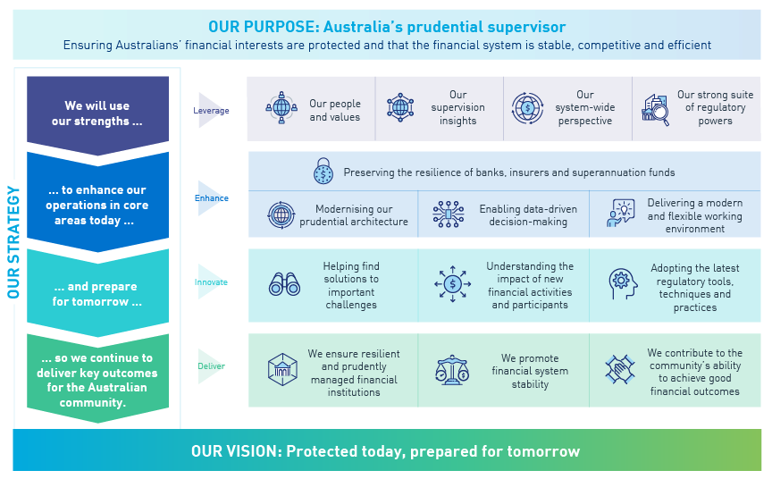

# Introduction to APRA and its Regulatory Process
### Understanding APRA’s Role in the Australian Financial System
**Presenter:** Pradeep Loganathan  
**Date:** 

---

# Agenda
1. Overview of APRA
2. APRA’s Consultation Process
3. Material Business Activity
4. Key Prudential Standards (CPS 231 & CPS 234)
5. Implementation Guidance
6. Conclusion

---

# Overview of APRA
### What is APRA?
- Australian Prudential Regulation Authority
- Regulates banking, insurance, and superannuation sectors

### Purpose
- APRA's primary purpose is to ensure the stability of Australia's financial system and protect depositors, policyholders, and superannuation fund members. [cite: 40, 43]
- It works in tandem with other regulatory bodies, including the Australian Treasury, the Reserve Bank of Australia, and the Australian Securities and Investments Commission (ASIC). [cite: 41]

---

# APRA’s Consultation Process
### Definition
- Collaborative approach to ensure compliance and risk management

### Steps
1. Identification of Material Business Activity
2. Risk Assessment
3. APRA Consultation for High-Risk Arrangements
4. Implementation and Monitoring

### Outcome
- Minimize disruptions and ensure regulatory alignment

---

# Material Business Activity
### Definition
- Activities critical to the entity's operations or regulatory compliance

### Risk Categories
- **Low:** Minimal impact on business operations. [cite: 67]
- **Heightened:** Impacts critical and/or sensitive IT assets, potentially affecting the entity's ability to meet its obligations. [cite: 68, 69]
- **Extreme:** Could result in severe disruptions, threatening the entity's ability to continue meeting its obligations. [cite: 72, 73]

### Examples
- Outsourcing, cloud adoption, data management

---

# APRA test

---

# APRA Consultation Process

- The level of consultation required depends on the materiality and risk assessment of the activity. [cite: 57, 58]
    - Low Risk: No consultation required. [cite: 57, 58]
    - Heightened Risk: Consultation after internal governance processes. [cite: 57, 58]
    - Extreme Risk: Early consultation is encouraged. [cite: 57, 58]
- Any impact on a Material Business Activity requires consultation with APRA. [cite: 57, 58]

---

# Key Prudential Standards
### CPS 231 - Outsourcing
- Requirements for due diligence, governance, and risk management
- Emphasis on legally binding agreements

### CPS 234 - Information Security
- Mandates robust security capabilities
- Requirements:
  - Define roles and responsibilities
  - Implement controls
  - Notify APRA of incidents within 72 hours

---

# APRA Standards Implementation
### Guidelines
#### Development Environment
- Secure coding practices
- Role-based access control

#### Source Code Management
- Centralized repositories
- Multi-factor authentication

#### Deployment Practices
- Use of encryption (SSL/TLS, at rest and in transit)
- Application monitoring

---

# Shared Responsibility Model
### Cloud Adoption Context
- Clear delineation of responsibilities:
  - Customer
  - Cloud provider
  - Vendor (e.g., VMware)

### Key Actions
- Ensure compliance with APRA standards
- Design for flexibility and resilience

---

# Conclusion
- APRA ensures stability and security in Australia’s financial system
- Key focus: Risk assessment, compliance, and operational continuity
- Prudential Standards CPS 231 & CPS 234:
  - Guidance for secure outsourcing and information security practices
- Shared responsibility requires collaboration between all stakeholders

---

# Q&A
## Questions?
