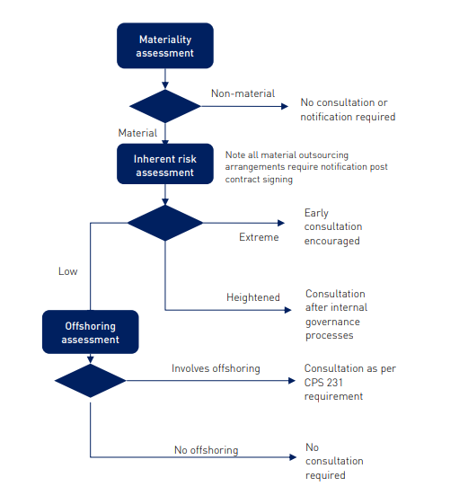

# Introduction to APRA and its Regulatory Process
### Understanding APRA’s Role in the Australian Financial System
**Presenter:** Pradeep Loganathan  
**Date:** 

---

# Agenda
1. Overview of APRA
2. APRA’s Consultation Process
3. Material Business Activity
4. Key Prudential Standards (CPS 231 & CPS 234)
5. Implementation Guidance
6. Conclusion

---
# The Guardian of Australia's Financial System

* **APRA**: Australian Prudential Regulation Authority  
  - Regulates banks, insurance companies, and superannuation funds.  
* **Primary Role**: Protect the interests of depositors, policyholders, and superannuation members.  
* **Scope**: Sets prudential standards, supervises financial institutions, and ensures financial soundness.  
* APRA ensures financial stability in Australia, safeguarding $4 trillion in assets.

---

# APRA Compliance is Not Optional

* **Financial Health:** APRA regulations ensure financial institutions maintain strong capital positions & risk management frameworks.
* **Reputational Risk:** Non-compliance can lead to significant fines, reputational damage, and even loss of license.
* **Operational Efficiency:** Meeting APRA requirements often necessitates robust IT systems and processes.

 

---

# Other regulators

* **Australian Securities and Investments Commission**: Regulate financial markets and services, ensuring they are fair, transparent, and efficient.
* **Reserve Bank of Australia (RBA)**: Australia's central bank. Responsible for monetary policy, financial system stability, and the payments system.   
* **AUSTRAC (Australian Transaction Reports and Analysis Centre)**: Focuses on anti-money laundering and counter-terrorism financing.   
* **Office of the Australian Information Commissioner (OAIC)**: The national privacy regulator, enforcing privacy laws and promoting good information handling practices.

---
# Where APRA Sets the Standards

* **Capital Adequacy:** Maintaining sufficient capital to absorb potential losses. (e.g., Basel III framework)
* **Risk Management:** Identifying, assessing, and managing various risks (credit risk, operational risk, market risk).
* **Governance and Accountability:** Clear organizational structure, sound decision-making processes, and responsible reporting.
* **Information Security:** Protecting sensitive data and systems from cyber threats and breaches. (e.g., CPS 234)
* **Outsourcing:** Managing risks associated with outsourcing critical functions to third-party providers. ( e.g,. CPS 231)
---

# IT: The Backbone of APRA Compliance

* **Data Management:** Robust data governance, storage, and analytics capabilities for reporting and risk assessment.
* **Reporting and Analytics:** Tools for generating accurate and timely reports to meet APRA's requirements.
* **Compliance Monitoring:** Systems to track and monitor compliance with APRA regulations and identify potential breaches.
* **Security and Resilience:** Implementing security measures to protect data and systems and ensure business continuity.
* **Automation:** Automating compliance tasks to reduce manual effort and improve efficiency.

---

# APRA Consultation Process

* What is Materiality

---
# Real-World Impact - 1

##  **Macquarie Bank Limited (2021)**  
- **Incident:**  
  - APRA identified multiple material breaches of prudential and reporting standards.  
- **Action Taken:**  
  - APRA increased Macquarie Bank’s liquidity and operational risk capital requirements.  
- **Impact:**  
  - Highlighted deficiencies in risk management, placing significant pressure on senior leadership to address the failures.  
  - [More Details](https://www.apra.gov.au/news-and-publications/apra-takes-action-against-macquarie-bank-over-multiple-breaches-of-prudential)

---

# Real-World Impact - 2

## **Bank of Queensland (2023)**  
- **Incident:**  
  - APRA found weaknesses in risk management, governance, and risk culture.  
- **Action Taken:**  
  - APRA accepted a court-enforceable undertaking from BOQ to rectify deficiencies.  
- **Impact:**  
  - Management focus shifted toward compliance improvements under increased regulatory scrutiny.  
  - [More Details](https://www.apra.gov.au/news-and-publications/apra-agrees-to-court-enforceable-undertaking-from-bank-of-queensland)

---
# Relevant Control Groups
---

## **1. Information Security Capabilities**

### Relevant Control: **CPS 234.5**
*"An APRA-regulated entity must maintain information security capabilities commensurate with the size and extent of threats to its information assets, and sufficient to ensure the continued sound operation of the entity."*

### Mapping:
- **Code Scanning & Static Analysis:** Identify vulnerabilities early to secure applications.
- **Vulnerability Management:** Continuously assess and mitigate threats.
- **CI/CD Pipeline Scanning:** Secure each stage of the software lifecycle against potential threats.

---

## **2. Implementation of Controls**

### Relevant Control: **CPS 234.10**
*"Information security controls must be implemented to protect information assets commensurate with their criticality and sensitivity."*

### Mapping:
- **Static Code Analysis:** Acts as a control to identify and remediate vulnerabilities in critical systems.
- **Container Registry Scanning:** Ensures deployed images are free from vulnerabilities.
- **Artifact Scanning in CI/CD Pipelines:** Ensures software artifacts comply with security standards before deployment.

---

## **3. Testing and Assurance**

### Relevant Control: **CPS 234.11**
*"An APRA-regulated entity must test the effectiveness of information security controls through a systematic testing program."*

### Mapping:
- **Static Analysis & Vulnerability Scanning:** Automated tools provide continuous assurance.
- **CI/CD Pipeline Scanning:** Enables security testing during each pipeline stage.
- **Penetration Testing & Vulnerability Assessments:** Complements automated scanning for holistic assurance.

---

## **4. Incident Management**

### Relevant Control: **CPS 234.15**
*"Entities must detect and respond to information security incidents in a timely manner."*

### Mapping:
- **Vulnerability Management:** Proactively identifies and remediates vulnerabilities to prevent incidents.
- **Alerting and Monitoring**: Use ASPM tools to detect anomalous application behaviors in real time.
- **Incident Response Automation**: Automate responses to detected application vulnerabilities or misconfigurations.
- **Forensics and Root Cause Analysis**: Integrate application-level forensic tools to support incident investigations.

---

## **5. Third-Party Arrangements**

### Relevant Control: **CPS 234.20**
*"An APRA-regulated entity must evaluate the information security capability of third parties that manage information assets."*

### Mapping:
- **Container Registry Scanning:** Ensures third-party images in the supply chain are free from vulnerabilities.
- **Dependency Scanning:** Verifies that third-party libraries meet security standards.
- **Third-Party Application Scanning**: Scan applications and libraries from third-party providers for vulnerabilities.
- **SBOM (Software Bill of Materials)**: Maintain and assess SBOMs for third-party applications to identify risks.
---

## **6. Timeliness of Remediation**

### Relevant Control: **CPS 234.16**
*"Entities must rectify identified information security control weaknesses in a timely manner."*

### Mapping:
- **Vulnerability Management Tools:** Track and prioritize remediation of discovered vulnerabilities.
- **Patch Management**: Ensure rapid deployment of patches for vulnerabilities identified in applications.
- **Risk-Based Prioritization**: Use ASPM tools to prioritize vulnerabilities based on criticality and impact.
- **CI/CD Pipeline Scanning:** Automates detection, ensuring vulnerabilities are addressed before deployment.

---
# Speaking the CXO Language

1. **Focus on Business Outcomes:**  
   - "How does this help achieve your strategic rgulatory objectives?"  
2. **Quantify the Value:**  
   - "Our platform reduces compliance costs by 20% annually."  
3. **Address Pain Points:**  
   - "What challenges are you facing with CPS 234 audits?"  
4. **Build Trust and Credibility:**  
   - "Here’s how we’ve helped similar organizations achieve compliance."  
---

# APRA Compliance: A Shared Responsibility

* APRA regulations are fundamental to the stability and integrity of the Australian financial system.
* Technology plays a crucial role in enabling financial institutions to meet APRA requirements.
* By understanding APRA's focus areas, technology sellers can effectively position their solutions to CXOs.
* Successful engagements with CXOs require a focus on business outcomes, value quantification, and building trust.

---

# Conclusion
- APRA ensures stability and security in Australia’s financial system
- Key focus: Risk assessment, compliance, and operational continuity
- Prudential Standards CPS 231 & CPS 234:
  - Guidance for secure outsourcing and information security practices
- Shared responsibility requires collaboration between all stakeholders

---

# Q&A
## Questions?

---
# Backup
---

# Material Business Activity
## Definition
- Activities critical to the entity's operations or regulatory compliance

## Risk Categories
- **Low:** Minimal impact on business operations. [cite: 67]
- **Heightened:** Impacts critical and/or sensitive IT assets, potentially affecting the entity's ability to meet its obligations. [cite: 68, 69]
- **Extreme:** Could result in severe disruptions, threatening the entity's ability to continue meeting its obligations. [cite: 72, 73]

## Examples
- Outsourcing, cloud adoption, data management

---

# Key Prudential Standards
## CPS 231 - Outsourcing
- Requirements for due diligence, governance, and risk management
- Emphasis on legally binding agreements

## CPS 234 - Information Security
- Mandates robust security capabilities
- Requirements:
  - Define roles and responsibilities
  - Implement controls
  - Notify APRA of incidents within 72 hours

---

# APRA Standards Implementation
## Guidelines
### Development Environment
- Secure coding practices
- Role-based access control

### Source Code Management
- Centralized repositories
- Multi-factor authentication

### Deployment Practices
- Use of encryption (SSL/TLS, at rest and in transit)
- Application monitoring

---

# Shared Responsibility Model
## Cloud Adoption Context
- Clear delineation of responsibilities:
  - Customer
  - Cloud provider
  - Vendor (e.g., VMware)

## Key Actions
- Ensure compliance with APRA standards
- Design for flexibility and resilience

---

