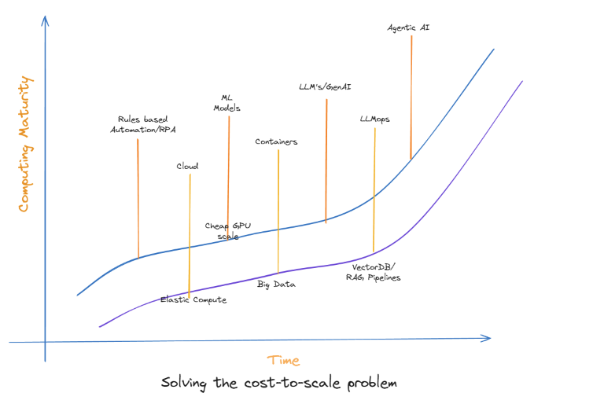

<!-- _class: title-slide -->

# Agentic AI

## The Actor Model Imperative 

By Pradeep Loganathan

---

<!-- 
To understand Agentic AI, let's quickly see how we got here. We've evolved software architectures from chunky monoliths to agile microservices, while simultaneously mastering infrastructure with virtualization, containerization, and Kubernetes for immense scale. Parallel to that, AI capabilities exploded, from big data insights to powerful ML models, and now, game-changing LLMs. The amazing thing is, these three journeys – flexible software, robust infrastructure, and advanced AI – are now converging. This allows us to move beyond AI that just answers questions, to Agentic AI that can autonomously act, plan, and achieve complex goals, marking a fundamental shift in how we build intelligent systems. 

Given this powerful convergence leading us to Agentic AI, the natural next question is: what does the market actually say about its potential? This next slide gives us a clear picture...
-->

# Architecture - Inflection Points

<!-- _class: image-slide -->

---

<!--
This graph vividly illustrates the immense potential of the Agentic AI Architecture Market. We're looking at a projected surge from around $1 billion in 2025 to nearly $50 Billion by 2034, reflecting a a truly staggering 44.5% Compound Annual Growth Rate. Notably, the vast majority of this growth is expected in cloud-based deployments, which makes perfect sense given the scalability needs of Agentic AI. This isn't just theory; these numbers underscore massive industry investment and confidence. It clearly shows that building robust architectures for Agentic AI is where the market is absolutely headed.

With that kind of market opportunity, it's clear why Agentic AI is so important. So, let's zoom in and define what an AI agent truly is..
-->

# Agentic AI Market
<!-- _class: image-slide -->

---
# What is Agentic AI

<!-- _class: image-slide -->

---

<!-- 
An AI agent is a software system designed to interact with its environment, collect data, and perform tasks autonomously to achieve predetermined goals. These agents are not simply programmed to follow instructions, but they can make decisions, learn, and adapt to changing circumstances.

So, that's the definition of an AI agent. To truly grasp how these intelligent systems operate and deliver value, let's explore a concrete example: our Research Assistant Agent.
-->

<!-- _class: image-slide -->
# AI Agent

---

<!-- "This Research Assistant Agent is essentially your smart research partner. You send it a request – either for live updates, or for a full report delivered later. Inside, a specialized 'Researcher Agent' gets to work, digging for information by talking to a powerful LLM like GPT-4 or Mistral. Once the facts are gathered, a 'Reporting Agent' takes over to organize, synthesize, and present those findings clearly for you. This multi-agent setup means specialized AIs collaborate on different parts of the task, making the entire research process incredibly efficient and effective -->

<!-- _class: image-slide -->
# Research Assistant Agent

---

<!-- The Research Assistant Agent in the previous slide effectively demonstrated multi-agent collaboration in action. But it's built on foundational ideas and strategies. ther are various patterns of interaction,such as using tools or reflecting on their own actions, which you'll find across many sophisticated agentic systems. -->

<!-- _class: image-slide -->
# Multi Agent Patterns

---
<!-- 
Those multi-agent patterns are fundamental to how agents operate and become intelligent. But when we talk about Agentic AI as a whole, what are the non-negotiables? What are the Core Demands and, more specifically, the Key Characteristics these systems absolutely must have to deliver on their promise?

....

So, those are the critical characteristics that make Agentic AI so powerful and define their potential. However, achieving them isn't without its hurdles: these agents often rely on external services that can be 'failure-prone' and communicate with 'high-latency' LLMs. This inherently demands incredibly robust and resilient underlying architectures to ensure these autonomous agents can consistently deliver on their promise. -->

# Agentic AI - The Core Demands

-   **Autonomous, Context-Aware, Action-Oriented Services:** Intelligent, long-running workflows that call Large Language Models (LLMs), process responses, and execute actions.
  -   **Key Characteristics:**
    -   **Durable Execution:** Workflows complete reliably.
    -   **Context Retention:** Agents maintain context across interactions.
    -   **Coordination:** Adaptability and distributed coordination.
    -   **Tool Use:** Integration with databases, APIs, and enterprise systems.
-   **The Challenge:** Dependency on failure-prone services and high-latency LLMs demands robust underlying architectures.

---

<!-- While Agentic AI offers immense potential, making it a reality highlights crucial architectural complexities. 

So, what are the biggest hurdles when actually building these Agentic AI systems? We're grappling with ensuring Reliability in distributed environments, handling the inherent Latency & Performance issues from dependencies like LLMs, managing complex State across long-running interactions, and overcoming Scalability Limitations to meet dynamic demand. These challenges collectively highlight why a robust underlying architecture is absolutely critical. -->

# Key Challenges in Building Agentic Systems

- **Reliability:** Traditional architectures struggle with distributed failure.
- **Latency & Performance:** High-latency dependencies (e.g., LLM calls).
- **State Management Complexity:** Stateless serverless models face significant overhead.
- **Scalability Limitations:** Difficulties scaling dynamically to meet demand.
---

<!--
So, we've explored the Key Challenges in Building Agentic Systems, including reliability and latency. Why do these architectural challenges matter so much? Because when they're not effectively addressed, they lead directly to incredibly costly downtime. Let's look at the staggering financial impact.

This slide starkly illustrates the severe financial impact of downtime, particularly for critical systems like Agentic AI. The largest hit is typically $49 million in lost revenue, but downtime cascades into numerous other significant costs. You'll see millions in regulatory fines, SLA penalties, brand damage, and even direct recovery costs. This demonstrates that system downtime is far more than just lost sales; it's a multi-faceted financial disaster that organizations must avoid.

For those of you building or managing complex systems, which of these challenges – reliability, latency, state management, or scalability – resonates most with your current experiences, or do you foresee others?
 -->

<!-- _class: image-slide -->

# Cost of Downtime

---
<!-- 
Given those staggering costs of downtime and the architectural challenges we discussed, it's clear we need a fundamentally different approach to build truly robust and scalable Agentic AI. And that brings us to The Solution: The Actor Model – a powerful paradigm perfectly suited for this new era.

So, what exactly is The Actor Model? At its core, it's a way of building concurrent systems where everything is an 'Actor' – a lightweight, isolated entity that communicates only via asynchronous messages. This design brings immense advantages for Agentic AI: it naturally provides Concurrency & Scalability, offers robust Fault Isolation & Resilience allowing for self-healing systems, and ensures Location Transparency. Critically, the Actor Model directly addresses many of the Agentic AI challenges we just covered, simplifying complex communication, state management, and enabling truly horizontal scaling for high performance. -->

# The Solution: The Actor Model

-   **Core Concept:** Actors are lightweight, isolated, asynchronous entities communicating via messages.
    -   **Strict State Isolation:** Each actor owns its state, preventing race conditions.
    -   **Asynchronous Messaging:** Decouples sender from receiver, non-blocking.
-   **Key Advantages for Agentic AI:**
    -   **Concurrency & Scalability:** Handles vast concurrent workloads efficiently across cores/networks.
    -   **Fault Isolation & Resilience:** Failures contained within actors; hierarchical supervision enables self-healing.
    -   **Location Transparency:** Actors communicate uniformly regardless of physical location.
-   **Addresses Agentic AI Challenges:** Simplifies inter-agent communication, state management, and enables horizontal scaling

---

<!-- So, the Actor Model provides a robust solution to those architectural challenges. But is it just theory, or does it actually work in practice for Agentic AI? The answer is a resounding yes! Let's look at the Actor Model in Action: Real-world Validation.

The Actor Model isn't just theory; it's proving its worth right now in real-world Agentic AI systems. We're seeing Emerging Agentic AI Frameworks like LangGraph, AutoGen, and CrewAI directly adopting actor principles for building intelligent multi-agent applications with LLMs. What's even more compelling is its foundation in Battle-Tested Platforms like Akka, known for high-performance and resilience, and Erlang/BEAM, which famously powers massive distributed systems like WhatsApp. This long history of proven, robust performance clearly validates the Actor Model as the ideal choice for scalable, high-performing Agentic AI. -->

# Actor Model in Action: Real-world Validation

-   **Emerging Agentic AI Frameworks:**
    -   **LangGraph:** Designed for "stateful multi-actor applications with LLMs".
    -   **AutoGen, CrewAI:** Focus on multi-agent messaging and collaboration, echoing Actor principles.
-   **Battle-Tested Platforms:**
    -   **Akka:** High-performance, "elastic, agile, and resilient" foundation for agent lifecycle management and fault tolerance.
    -   **Erlang/BEAM:** Powers massive distributed systems like **WhatsApp**. Handles **>8000 cores** and **>70 Million Erlang messages/second**. Supports hot-reloading and ensures single thread crashes don't bring down the system.

---

<!-- So, we've seen that the Actor Model isn't just theory – it's battle-tested and powering cutting-edge Agentic AI frameworks. But what are the tangible results? What kind of Business Outcomes and ROI can you truly expect when adopting the Actor Model for your Agentic AI initiatives?

The Actor Model delivers compelling Business Outcomes and ROI across the board. Companies are seeing Reduced Operational Costs and Increased Efficiency, like Akka cutting model validation costs by 90% and Erlang powering WhatsApp's massive scale. It drives Improved Performance & Agility, with examples like Swiggy achieving 2x latency improvements. Furthermore, it enables Enhanced Customer Experience & Revenue through hyper-personalization and robust Agentic AI in customer service, all while ensuring Near-Continuous Availability due to its inherent fault isolation and self-healing capabilities. -->

# Business Outcomes & ROI with Actor Model

-   **Reduced Operational Costs & Increased Efficiency:**
    -   **Yields:** Cut model validation costs by **90%** with Akka.
    -   **WhatsApp:** Handles billions of messages with efficient server footprint using Erlang.
-   **Improved Performance & Agility:**
    -   **Swiggy:** Achieved **2x latency improvement** in ML/AI platform using Akka.
    -   **John Deere:** Combines analyze data from **over 1,000 sensors** with Akka to optimize ROI.
-   **Enhanced Customer Experience & Revenue:**
    -   **Tubi:** Boosted ad revenue through hyper-personalized experiences enabled by robust architecture.
    -   **Agentic AI in Customer Service:** Leads to lower ticket volume, faster resolution, better CSAT, and global 24/7 coverage. Scales human capabilities, not replaces them.
-   **Near-Continuous Availability:** Fine-grained fault isolation and self-healing lead to near-continuous availability.

---

<!-- We've seen the impressive real-world validation and the compelling business outcomes that the Actor Model delivers. All this evidence brings us to our undeniable Conclusion: It's an Architectural Imperative for the age of Agentic AI.

To conclude, the autonomous and multi-agent nature of Agentic AI fundamentally demands a robust architectural foundation. The Actor Model provides an unparalleled framework with its isolated actors, asynchronous messaging, and inherent fault tolerance, aligning perfectly with Agentic AI's distributed and proactive design. Proven platforms like Akka and Erlang offer a clear blueprint for success. Therefore, embracing the Actor Model isn't just an option; it's an architectural imperative to unlock the transformative potential of autonomous intelligence and secure long-term competitive advantage. -->

# Conclusion: An Architectural Imperative

-   Agentic AI's autonomy and multi-agent nature demand a robust architectural foundation.
-   The **Actor Model** provides an unparalleled framework: independent actors, asynchronous messaging, strict state isolation, inherent fault tolerance.
-   It aligns naturally with the modular, distributed, and proactive nature of Agentic AI entities.
-   Proven platforms like Akka and Erlang offer a clear blueprint for reliable, scalable Agentic AI.
-   Embracing the Actor Model is an **architectural imperative** to unlock the transformative potential of autonomous intelligence and ensure long-term competitive advantage.

---
<!-- So, that brings us to the end of our deep dive into why embracing the Actor Model is truly an architectural imperative for unlocking the transformative potential of Agentic AI.
I hope this journey through Agentic AI, its challenges, and the power of the Actor Model has given you some valuable insights. Thank you again for your time today. -->

<!-- _class: questions-slide -->

# Questions?

## Thank you for your time!

Feel free to reach out with any questions or feedback.

---
