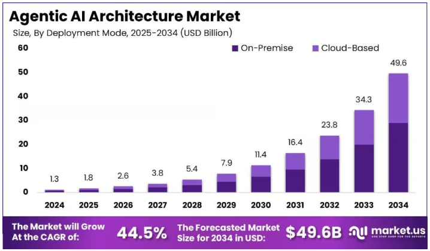

<!-- _class: title-slide -->

<!--
**Talking Points for Title Slide:**
- Welcome the audience and introduce yourself
- Set the stage: We're at an inflection point in AI architecture
- Today we'll explore how the Actor Model addresses critical challenges in Agentic AI
- This is about building resilient, scalable AI systems for the future
-->

# Agentic AI

## The Actor Model Imperative 

By Pradeep Loganathan

---

<!--
**Talking Points for 'Architecture - Inflection Points':**
1. **Evolution of Software Architecture**
   - Monolithic → SOA → Microservices → Serverless
   - Each evolution addressed specific scaling challenges
   - Now we're entering the era of Agentic Systems

2. **Key Shift**
   - From request/response to autonomous, long-running agents
   - From stateless to stateful, persistent entities
   - From synchronous to asynchronous processing

3. **The Challenge**
   - Traditional architectures weren't designed for this paradigm
   - Need for new approaches to state, concurrency, and fault tolerance
-->

# Architecture - Inflection Points
<!-- _class: image-slide -->

---

<!--
**Talking Points for 'Agentic AI Market':**
1. **Market Growth**
   - Rapid adoption across industries
   - Both tools and enterprise solutions growing
   - Shift from experimental to production deployments

2. **Key Drivers**
   - Need for automation and efficiency
   - Advancements in LLMs and AI capabilities
   - Increasing complexity of business processes

3. **Opportunity**
   - Early adopters gaining competitive advantage
   - Potential to transform customer experiences
   - New business models enabled by autonomous agents
-->

# Agentic AI Market
<!-- _class: image-slide -->

---

<!--
**Talking Points for 'The Rise of Agentic AI':**
1. **Market Momentum**
   - 56.1% CAGR shows rapid adoption
   - Both tools and enterprise solutions growing
   - Shift from experimental to production use cases

2. **Key Drivers**
   - Need for real-time decision making
   - Increasing complexity of business processes
   - Competitive pressure to automate and scale

3. **Business Impact**
   - Not just cost savings, but new capabilities
   - Enables 24/7 operations and global scale
   - Shifts human roles to higher-value activities
-->

# The Rise of Agentic AI

-   **Explosive Growth of AI-Driven Applications:** Demand for immediate insights and decisions is paramount.
-   **Market Projections:**
    -   Agentic AI Tools: **$6.67 Billion (2024) to $10.41 Billion (2025)**, a **56.1% CAGR**. Projected to reach **$61.45 Billion by 2029**.
    -   Enterprise Agentic AI: **$2.59 Billion (2024)**, forecasted to reach **$24.50 Billion by 2030** at a **46.2% CAGR**.
-   **The Imperative for Instant Value:**  Automation drives efficiency, precision, and productivity.
---

<!-- 
**Talking Points for 'Agentic AI - The Core Demands':**

1. **Autonomous Services**
   - Emphasize the shift from reactive to proactive AI systems
   - Highlight the need for systems that can operate independently over extended periods

2. **Key Characteristics**
   - **Durable Execution**: Discuss how modern AI systems must handle long-running processes without failing
   - **Context Retention**: Explain the importance of maintaining conversation/memory across sessions
   - **Coordination**: Talk about multi-agent systems and how they need to work together
   - **Tool Use**: Mention integration capabilities with existing enterprise systems

3. **The Challenge**
   - Address the reliability issues with current LLM services
   - Discuss the need for fault tolerance in AI systems
   - Highlight the importance of low-latency in production environments

**Transition:** This leads us to the key challenges we need to address...
-->

# Agentic AI - The Core Demands

-   **Autonomous, Context-Aware, Action-Oriented Services:** Intelligent, long-running workflows that call Large Language Models (LLMs), process responses, and execute actions.
  -   **Key Characteristics:**
    -   **Durable Execution:** Workflows complete reliably.
    -   **Context Retention:** Agents maintain context across interactions.
    -   **Coordination:** Adaptability and distributed coordination.
    -   **Tool Use:** Integration with databases, APIs, and enterprise systems.
-   **The Challenge:** Dependency on failure-prone services and high-latency LLMs demands robust underlying architectures.

---

<!--
**Talking Points for 'AI Agent' Diagram:**
1. **Architecture Overview**
   - Note the modular components
   - Emphasize the flow of data and decisions
   - Point out the separation of concerns

2. **Key Components**
   - Input processing and understanding
   - Decision-making core
   - Action execution and feedback loops

3. **Scalability**
   - How this architecture enables growth
   - Points of potential failure and how they're mitigated
   - Integration with existing systems
-->

<!-- _class: image-slide -->
# AI Agent

---

<!--
**Talking Points for 'Key Challenges':**
1. **Reliability**
   - Real-world example of distributed failure
   - Impact on user experience and business metrics
   - Why traditional approaches fall short

2. **Performance**
   - The cost of latency in user experience
   - Challenges with external dependencies
   - Balancing cost and performance

3. **State Management**
   - Complexity of maintaining context
   - Challenges with distributed state
   - Impact on development velocity

4. **Scalability**
   - Real-world scaling challenges
   - Cost implications of poor scaling
   - Need for elasticity
-->

# Key Challenges in Building Agentic Systems

- **Reliability:** Traditional architectures struggle with distributed failure.
- **Latency & Performance:** High-latency dependencies (e.g., LLM calls).
- **State Management Complexity:** Stateless serverless models face significant overhead.
- **Scalability Limitations:** Difficulties scaling dynamically to meet demand.
---

<!--
**Talking Points for 'Cost of Downtime':**
1. **Impact Analysis**
   - Walk through the numbers on the chart
   - Highlight industry-specific impacts
   - Discuss both direct and indirect costs

2. **Real Consequences**
   - Customer trust erosion
   - Employee productivity loss
   - Long-term brand damage

3. **Prevention**
   - Importance of reliability engineering
   - Cost of prevention vs. cost of failure
   - How the right architecture helps
-->

<!-- _class: image-slide -->

# Cost of Downtime

---

<!--
**Talking Points for 'The Actor Model':**
1. **Core Concept**
   - Simple analogy: Think of actors as independent workers
   - Emphasize the message-passing paradigm
   - Contrast with traditional threading models

2. **Key Advantages**
   - How it solves the reliability challenge
   - Benefits for state management
   - Scaling characteristics

3. **Agentic AI Fit**
   - Natural mapping to autonomous agents
   - Handling of long-running processes
   - Fault tolerance requirements

4. **Real-world Impact**
   - Performance improvements
   - Development velocity
   - Operational simplicity
-->

# The Solution: The Actor Model

-   **Core Concept:** Actors are lightweight, isolated, asynchronous entities communicating via messages.
    -   **Strict State Isolation:** Each actor owns its state, preventing race conditions.
    -   **Asynchronous Messaging:** Decouples sender from receiver, non-blocking.
-   **Key Advantages for Agentic AI:**
    -   **Concurrency & Scalability:** Handles vast concurrent workloads efficiently across cores/networks.
    -   **Fault Isolation & Resilience:** Failures contained within actors; hierarchical supervision enables self-healing.
    -   **Location Transparency:** Actors communicate uniformly regardless of physical location.
-   **Addresses Agentic AI Challenges:** Simplifies inter-agent communication, state management, and enables horizontal scaling

---

<!--
**Talking Points for 'Real-world Validation':**
1. **Emerging Frameworks**
   - LangGraph's approach to stateful actors
   - How AutoGen and CrewAI implement actor principles
   - Common patterns across these frameworks

2. **Production Systems**
   - WhatsApp's scale and reliability
   - Why these companies chose the Actor Model
   - Lessons learned at scale

3. **Key Takeaways**
   - Proven technology, not just theory
   - Battle-tested in demanding environments
   - Growing ecosystem and community
-->

# Actor Model in Action: Real-world Validation

-   **Emerging Agentic AI Frameworks:**
    -   **LangGraph:** Designed for "stateful multi-actor applications with LLMs".
    -   **AutoGen, CrewAI:** Focus on multi-agent messaging and collaboration, echoing Actor principles.
-   **Battle-Tested Platforms:**
    -   **Akka:** High-performance, "elastic, agile, and resilient" foundation for agent lifecycle management and fault tolerance.
    -   **Erlang/BEAM:** Powers massive distributed systems like **WhatsApp**. Handles **>8000 cores** and **>70 Million Erlang messages/second**. Supports hot-reloading and ensures single thread crashes don't bring down the system.

---

<!--
**Talking Points for 'Business Outcomes':**
1. **Cost Savings**
   - Specific examples of cost reduction
   - Impact on bottom line
   - ROI calculations

2. **Performance Improvements**
   - Real-world performance gains
   - Impact on user experience
   - Competitive advantage

3. **Business Impact**
   - Revenue growth examples
   - Customer satisfaction improvements
   - Market differentiation

4. **Operational Excellence**
   - System reliability
   - Team productivity
   - Innovation velocity
-->

# Business Outcomes & ROI with Actor Model

-   **Reduced Operational Costs & Increased Efficiency:**
    -   **Yields:** Cut model validation costs by **90%** with Akka.
    -   **WhatsApp:** Handles billions of messages with efficient server footprint using Erlang.
-   **Improved Performance & Agility:**
    -   **Swiggy:** Achieved **2x latency improvement** in ML/AI platform using Akka.
    -   **John Deere:** Combines analyze data from **over 1,000 sensors** with Akka to optimize ROI.
-   **Enhanced Customer Experience & Revenue:**
    -   **Tubi:** Boosted ad revenue through hyper-personalized experiences enabled by robust architecture.
    -   **Agentic AI in Customer Service:** Leads to lower ticket volume, faster resolution, better CSAT, and global 24/7 coverage. Scales human capabilities, not replaces them.
-   **Near-Continuous Availability:** Fine-grained fault isolation and self-healing lead to near-continuous availability.

---

<!--
**Talking Points for 'Conclusion':**
1. **Key Takeaways**
   - Recap the main points
   - Emphasize the architectural shift
   - Highlight the business imperative

2. **Call to Action**
   - Next steps for the audience
   - How to get started
   - Available resources

3. **Final Thought**
   - The future of AI is agentic
   - The time to architect for it is now
   - The competitive advantage is real
-->

# Conclusion: An Architectural Imperative

-   Agentic AI's autonomy and multi-agent nature demand a robust architectural foundation.
-   The **Actor Model** provides an unparalleled framework: independent actors, asynchronous messaging, strict state isolation, inherent fault tolerance.
-   It aligns naturally with the modular, distributed, and proactive nature of Agentic AI entities.
-   Proven platforms like Akka and Erlang offer a clear blueprint for reliable, scalable Agentic AI.
-   Embracing the Actor Model is an **architectural imperative** to unlock the transformative potential of autonomous intelligence and ensure long-term competitive advantage.

---
<!--
**Talking Points for 'Comparison' Slide:**
1. **Concurrency Model**
   - How each approach handles parallelism
   - Impact on developer productivity
   - Performance characteristics

2. **State Management**
   - Pros and cons of each approach
   - Impact on system design
   - Operational complexity

3. **Fault Tolerance**
   - How failures are handled
   - Impact on system reliability
   - Development overhead

4. **Scaling**
   - How each approach scales
   - Operational complexity
   - Cost implications
-->

# Backup Slides
---

# Comparison: Actor Model vs Microservices vs Traditional OOP

| Feature | Actor Model | Microservices | Traditional OOP |
|---------|-------------|---------------|-----------------|
| **Concurrency** | Built-in, async messaging | Explicit threading | Blocking calls |
| **State Management** | Stateful actors | External databases | Shared mutable state |
| **Fault Handling** | Supervision/self-healing | Manual retries | Exceptions, manual recovery |
| **Scaling** | Horizontal & elastic | Complex and costly | Limited & rigid |

---

<!--
**Talking Points for 'Agent Evolution' Diagram:**
1. **Evolution Path**
   - Key milestones in agent development
   - How capabilities have expanded
   - Current state of the art

2. **Key Innovations**
   - Breakthrough technologies
   - Architectural shifts
   - Performance improvements

3. **Future Direction**
   - Where the field is heading
   - Emerging trends
   - Opportunities for innovation
-->

<!-- _class: image-slide -->

---
