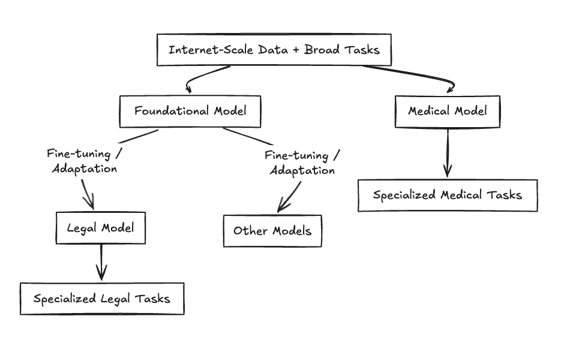
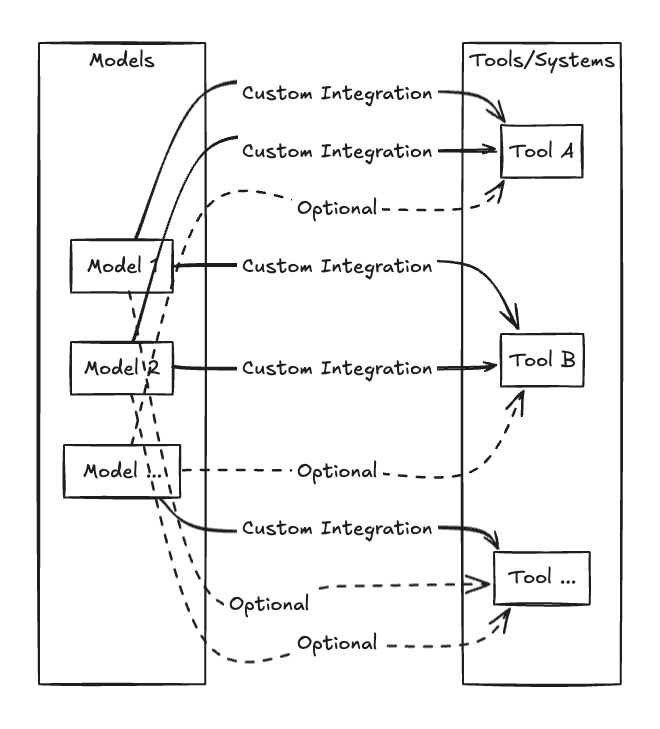
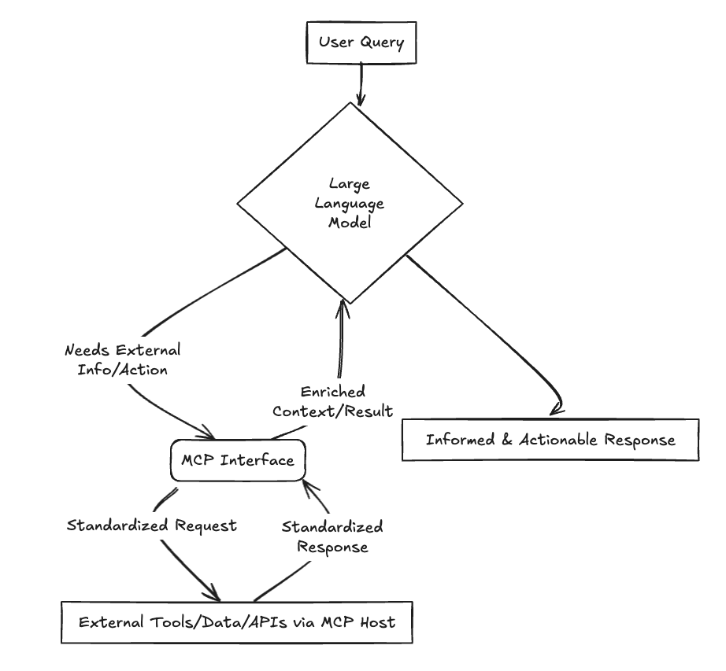
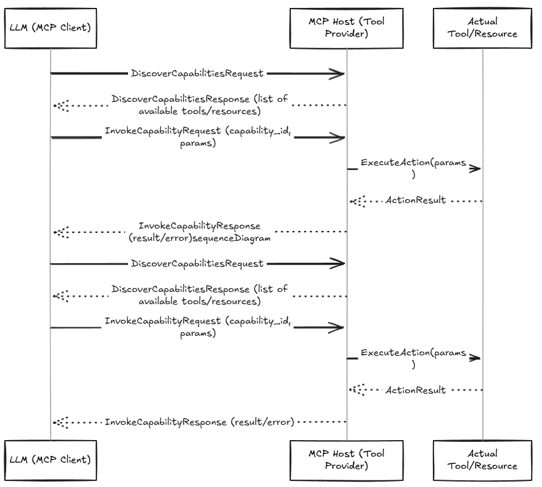
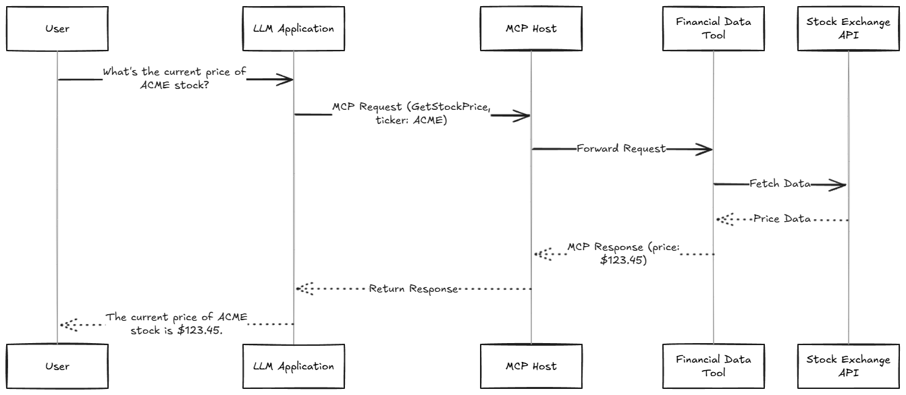

# Model Context Protocol (MCP)
## Bridging the Gap for AI Integration
Pradeep Loganathan

---

### The Landscape:
* **The Power and Limitations of LLMs:**
    * Remarkable capabilities but inherently isolated.
    * Knowledge is static, based on training data cut-offs.
* **Need for External Data:**
    * Access real-time information (news, stocks, etc.).
    * Incorporate proprietary/domain-specific knowledge.
    * Personalize responses.

---

### Integration approaches

* **Common Data Integration Approaches:**
    * Retrieval Augmented Generation (RAG)
    * Direct API Calls
    * Others .. LangChain et all

* **Need for External Tools & Resources:**
    * Perform actions (send emails, book appointments).
    * Utilize specialized computation (code interpreters, math solvers).
    * Access/manipulate files.

---

### The Landscape: Tools & Action-Taking

* **Common Tool Integration Approaches:**
    * Function Calling / Tool Usage (e.g., OpenAI Functions, LangChain Agents)
    * Custom API Integrations
    * Agentic Frameworks
---

## Foundational Models

* **Foundational Models (e.g., GPT-4, Claude, Llama):**
    * Trained on vast, diverse datasets (text, code, images).
    * Possess broad general knowledge and capabilities (text generation, summarization, translation, Q&A).
    * Serve as a base for many applications.
    * Can be powerful but may lack deep expertise in narrow domains or access to proprietary/real-time info.
---
## Use-Case Specific Models

* **Use-Case Specific Models:**
    * Often derived from foundational models via fine-tuning or specialized training.
    * Optimized for particular tasks or domains (e.g., medical diagnosis, legal document analysis, customer service bots).
    * May incorporate specific datasets, rules, or be smaller and more efficient for their target task.
    * Still often require integration with external tools/data for full functionality.
* *Both types of models benefit from robust integration strategies for external context.*

---

---

## The M x N Integration Challenge

* **The Core Problem:** Integrating *M* AI models with *N* external tools/APIs/data sources becomes exponentially complex.
* **1 Model x N Tools:**
    * Bespoke integrations for each tool.
    * Diverse auth methods, data formats, error handling.
    * Leads to brittle, hard-to-maintain deployments.
* **M Models x N Tools:**
    * Duplicated integration efforts across models.
    * Inconsistent behaviors.
    * Difficulty updating or swapping components.

* *This "spaghetti" of point-to-point integrations highlights the need for a standardized approach.*

---

---
---
## Solution: The Model Context Protocol (MCP)

* **What is MCP?**
    * A specification, initially proposed by researchers at Anthropic and since developed as an open standard, for how AI models can securely and reliably interact with external tools and data sources.
    * A standardized protocol designed to simplify and streamline how AI models interact with external tools, data, and systems.
* **Why MCP? Key Benefits:**
    * **Standardization:** Reduces complexity of M x N integrations.
    * **Interoperability:** Enables models and tools to connect more easily.
    * **Discoverability:** Allows models to find and understand available capabilities.
    * **Security:** Provides a framework for secure interactions.

---

## Core Idea & High-Level View of MCP

* **Fundamental Principles:**
    * **Decoupling:** MCP separates the AI model (client) from the external tools/data sources (host/provider). The model doesn't need to know the specifics of each tool's API.
    * **Standardized Interface:** It defines a common language (e.g., using JSON-RPC) for requests (e.g., "discover available tools," "invoke tool X with these parameters") and responses.
    * **Capability Advertisement:** Tool providers (MCP Hosts) advertise their capabilities (available tools, their inputs/outputs) in a structured way that MCP Clients (models) can understand.
    * **Secure Communication Channel:** The protocol incorporates mechanisms for secure data exchange, authentication, and authorization between the model and the tool provider.
---

---

## MCP: Under the Hood - Technical Foundations

* **Communication Backbone:**
    * JSON-RPC
    * Standardized message structures (requests, responses, notifications).
    
* **Flexible Transport Layers:**
    * STDIO (Standard Input/Output)
    * HTTP/SSE (Server-Sent Events)
    * WebSockets
   

---

## MCP: Capabilities & Interactions

* **Capability Discovery:**
    * How models find out what tools/resources are available.
    * Types: Tools (code interpreters), Resources (databases), Prompts.
* **Invocation Methods:**
    * How MCP facilitates calls to tools/resources.
    * Standardized handling of responses and errors.

---

---

---

