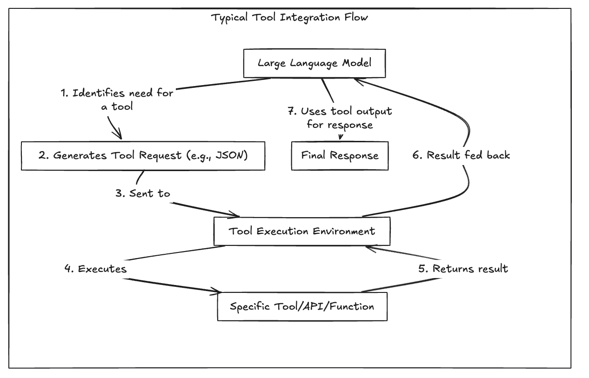
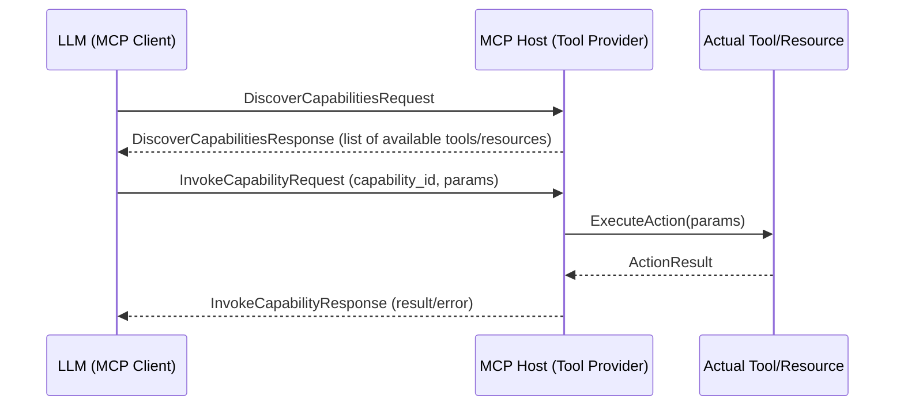
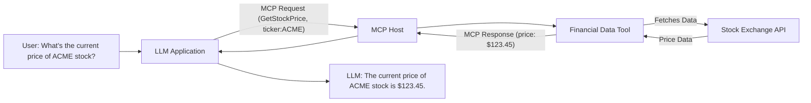
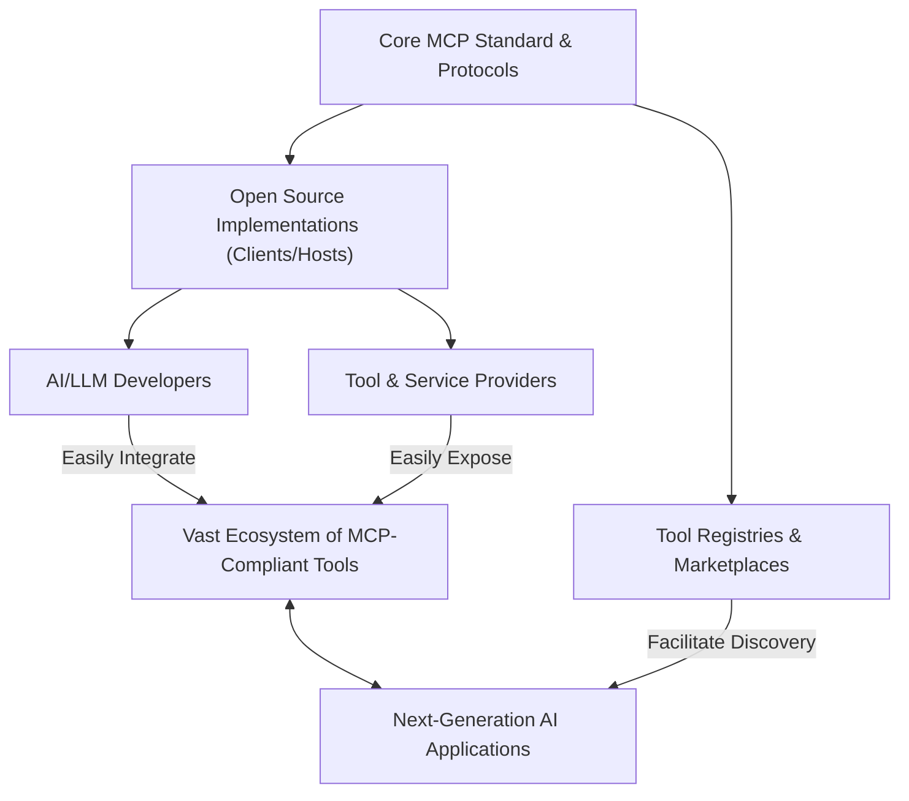

# Model Context Protocol (MCP)
## Bridging the Gap for AI Integration
Pradeep Loganathan

---

## The Landscape: LLMs & Integration Hurdles

* **The Power and Limitations of LLMs:**
    * Remarkable capabilities but inherently isolated.
    * Knowledge is static, based on training data cut-offs.
* **Need for External Data:**
    * Access real-time information (news, stocks, etc.).
    * Incorporate proprietary/domain-specific knowledge.
    * Personalize responses.
* **Common Data Integration Approaches:**
    * Retrieval Augmented Generation (RAG)
    * Fine-tuning
    * Direct API Calls

---

## The Landscape: Integration approaches

* **Common Data Integration Approaches:**
    * Retrieval Augmented Generation (RAG)
    * Fine-tuning
    * Direct API Calls

---

## The Landscape: Tools & Action-Taking

* **Need for External Tools & Resources:**
    * Perform actions (send emails, book appointments).
    * Utilize specialized computation (code interpreters, math solvers).
    * Access/manipulate files.
* **Common Tool Integration Approaches:**
    * Function Calling / Tool Usage (e.g., OpenAI Functions, LangChain Agents)
    * Custom API Integrations
    * Agentic Frameworks
---

## Tool integration Workflow
!

---

## Foundational vs. Use-Case Specific Models

* **Foundational Models (e.g., GPT-4, Claude, Llama):**
    * Trained on vast, diverse datasets (text, code, images).
    * Possess broad general knowledge and capabilities (text generation, summarization, translation, Q&A).
    * Serve as a base for many applications.
    * Can be powerful but may lack deep expertise in narrow domains or access to proprietary/real-time info.
* **Use-Case Specific Models:**
    * Often derived from foundational models via fine-tuning or specialized training.
    * Optimized for particular tasks or domains (e.g., medical diagnosis, legal document analysis, customer service bots).
    * May incorporate specific datasets, rules, or be smaller and more efficient for their target task.
    * Still often require integration with external tools/data for full functionality.
* *Both types of models benefit from robust integration strategies for external context.*

---
## Foundational & Specialized models

---

## The M x N Integration Challenge

* **The Core Problem:** Integrating *M* AI models with *N* external tools/APIs/data sources becomes exponentially complex.
* **1 Model x N Tools:**
    * Bespoke integrations for each tool.
    * Diverse auth methods, data formats, error handling.
    * Leads to brittle, hard-to-maintain deployments.
* **M Models x N Tools:**
    * Duplicated integration efforts across models.
    * Inconsistent behaviors.
    * Difficulty updating or swapping components.

* *This "spaghetti" of point-to-point integrations highlights the need for a standardized approach.*

---
[bg center 100%](./images/mxn-integration.png)
---

## Solution: The Model Context Protocol (MCP)

* **What is MCP?**
    * A specification, initially proposed by researchers at Anthropic and since developed as an open standard, for how AI models can securely and reliably interact with external tools and data sources.
    * A standardized protocol designed to simplify and streamline how AI models interact with external tools, data, and systems.
* **Why MCP? Key Benefits:**
    * **Standardization:** Reduces complexity of M x N integrations.
    * **Interoperability:** Enables models and tools to connect more easily.
    * **Discoverability:** Allows models to find and understand available capabilities.
    * **Security:** Provides a framework for secure interactions.

---

## Core Idea & High-Level View of MCP

* **Fundamental Principles:**
    * **Decoupling:** MCP separates the AI model (client) from the external tools/data sources (host/provider). The model doesn't need to know the specifics of each tool's API.
    * **Standardized Interface:** It defines a common language (e.g., using JSON-RPC) for requests (e.g., "discover available tools," "invoke tool X with these parameters") and responses.
    * **Capability Advertisement:** Tool providers (MCP Hosts) advertise their capabilities (available tools, their inputs/outputs) in a structured way that MCP Clients (models) can understand.
    * **Secure Communication Channel:** The protocol incorporates mechanisms for secure data exchange, authentication, and authorization between the model and the tool provider.
---

## MCP: A Simplified View**
[bg center 100%](./images/mcp-simplified.png)
---

## MCP: Under the Hood - Technical Foundations

* **Communication Backbone:**
    * JSON-RPC: [Explain its role in MCP as per the blog - e.g., lightweight, request/response]
    * Standardized message structures (requests, responses, notifications).
    
* **Flexible Transport Layers:**
    * STDIO (Standard Input/Output): [Use cases/details from blog]
    * HTTP/SSE (Server-Sent Events): [Use cases/details from blog]
    * WebSockets: [Use cases/details from blog]
    * [Mention any pros/cons discussed for each in the blog]

---

## MCP: Capabilities & Interactions

* **Capability Discovery:**
    * How models find out what tools/resources are available.
    * [Explain the mechanism from the blog: e.g., registration, manifests, discovery endpoints]
    * Types: Tools (code interpreters), Resources (databases), Prompts.
* **Invocation Methods:**
    * How MCP facilitates calls to tools/resources.
    * [Describe sync/async calls, streaming, specific patterns from the blog]
    * Standardized handling of responses and errors.

---

## MCP: Security by Design

* **Key Security Principles:**
    * Authentication: [How client/server identities are verified - from blog]
    * Authorization: [Permission management for tools/resources - from blog]
    * Data Privacy: [Measures for data protection - from blog]
    * Sandboxing: [Isolating tool execution - from blog]
    * [Add other security aspects discussed in the blog]

---

## MCP: Interaction Flow Example

* *Instructions: Replace with a more detailed/specific technical Mermaid diagram from the blog if available.*

---

## Putting MCP into Practice (Assumed Content)

* **For Tool Providers: Setting up an MCP Host**
    * [Steps/considerations for exposing tools via MCP - Get from blog]
    * Server-side libraries or SDKs?
* **For Model Integrators: Using an MCP Client**
    * [Client-side integration details - Get from blog]
    * How models formulate MCP requests.
* **Defining Capabilities: Schemas & Interfaces**
    * [How are tools described? OpenAPI, JSON Schema, custom format? - From blog]

---

## MCP in Action: Illustrative Use Cases (Assumed Content)

* **Example: [Name of Use Case from Blog, e.g., Live Financial Data Query]**
    * Description: [Details of the use case]
    * How MCP enables it: [Specific MCP features utilized]
    * [Relevant diagram if available in the blog]

* *Instructions: Replace with an actual use case and diagram from the blog.*
* **Further Examples:**
    * [List other use cases mentioned in the blog]

---

## The Road Ahead: Advanced MCP & Future Vision (Assumed Content)

* **Advanced Capabilities:**
    * [e.g., Tool Chaining, Context Caching, Complex Orchestrations - Get from blog]
* **Building the MCP Ecosystem:**
    * [Adoption status, community efforts, related tools/platforms - Get from blog]
* **Addressing Challenges & Limitations:**
    * [Any discussed in the blog series - e.g., security complexities, discovery at scale]
* **Future Development / Roadmap:**
    * [Planned features or vision for MCP's evolution - Get from blog]

---

## MCP: Envisioning the Future (Assumed Content)

* *Instructions: Replace with a relevant future/ecosystem diagram from the blog if available.*

---

## Conclusion & Discussion

* **Recap: The Value Proposition of MCP**
    * [Summarize key advantages: Simplification, Standardization, Scalability, Security]
* **Call to Action / Next Steps**
    * [e.g., Read the full blog series, explore available implementations, contribute to the standard if applicable]
* **Thank You & Questions?**