<!-- Slide 1 -->
<!-- Speaker notes:
**Opening Statement**:
"Good [morning/afternoon], everyone. I’m [Your Name], and I’m thrilled to take you on a journey into how Snyk enables organizations to build trusted software with speed, confidence, and security."

**Transition to Context**:
- "As we dive into today’s session, I want you to think about the central role software plays in driving innovation and growth across every industry. Yet, with this rapid evolution comes an equally pressing challenge—how do we ensure security doesn’t become a bottleneck?"
- "This is where Snyk comes in. Our mission is simple yet powerful: to empower developers to build software securely without slowing down innovation."

**Setting the Stage**:
- "Over the next few minutes, we’ll explore how Snyk transforms application security from a blocker into an enabler for developers and businesses alike."
- "We’ll look at real-world customer stories, the challenges they faced, and how Snyk helped them deliver secure software faster."
- "Finally, we’ll break down why Snyk is uniquely positioned as the leader in developer security, trusted by thousands of organizations worldwide."

**Transition to Next Slide**:
"Let’s begin by looking at the key shifts in software development that make security more critical—and more challenging—than ever before."
-->
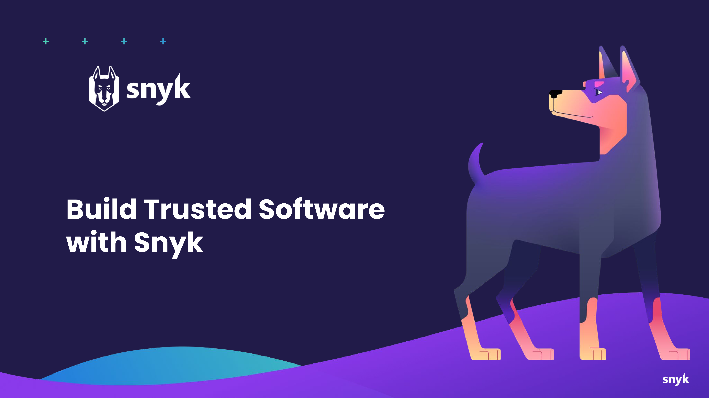

---

<!-- Slide 2 -->
<!-- Speaker notes:
Opening Statement: "For organizations building their future on software innovation, integrating security into development processes is no longer optional—it’s a necessity. This is where the concept of 'shift-left security' becomes crucial. Let’s consider the forces reshaping the way we develop and deploy software"

Key Point 1 - DevOps: "In the DevOps world, rapid iteration and deployment leave no room for traditional security practices that involve stopping to audit. Security needs to be embedded directly into the development process to match the pace of DevOps."

Key Point 2 - Cloud: "As cloud adoption grows, infrastructure security is shifting to become developer-driven. Developers now define and manage the infrastructure, which means security practices must be baked into their workflows and tools."

Key Point 3 - AI: "With the rise of generative AI tools creating code, often with minimal developer supervision, the risk of introducing vulnerabilities increases. AI-powered development must be supported with robust security measures to ensure the code remains safe."

These transformative trends—DevOps for speed, Cloud for scale, and AI for innovation—make security an integral part of development. Let’s explore why shift-left security is more critical than ever.
-->
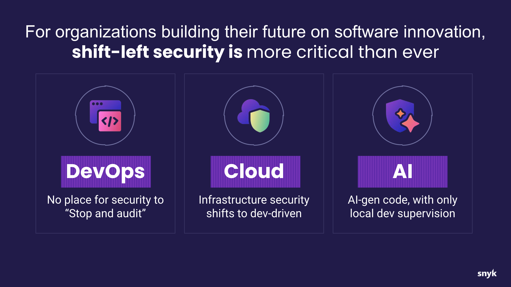

---

<!-- Slide 3 -->
<!-- Speaker notes:
Conclusion: "This is why shift-left security is more critical than ever—security needs to be fast, integrated, and developer-friendly to keep pace with these transformative trends."

Suggested Discovery Questions:
Are your developers leveraging gen AI tools to write code faster?
What are you doing to secure the use of AI?
-->
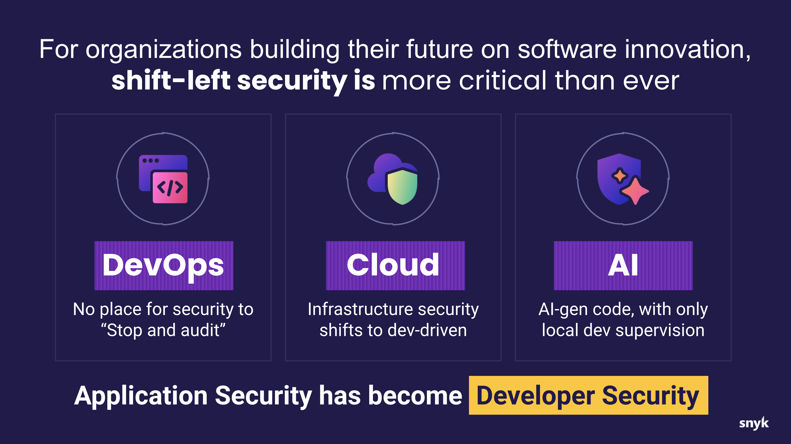

---
<!-- Slide 5 -->
<!-- Speaker notes:
Opening Statement: "The AI revolution is transforming how developers build software. However, with this revolution comes the need for a fundamental shift in how we approach security. Trusted developer security is no longer optional—it's essential."

Key Statistic 1 - Developer Adoption: "92% of developers are already using AI-generated code in some capacity. This shows how quickly AI tools like GitHub Copilot are being adopted to accelerate development."

Key Statistic 2 - Development Speed: "AI is projected to double the speed of development, enabling teams to ship features faster than ever before. But speed without security introduces risk."

Key Statistic 3 - Vulnerabilities in AI-Generated Code: "However, 40% of programs generated by Copilot have shown vulnerabilities. This underscores the importance of integrating security tools into the AI-driven development lifecycle. For example, GitHub Copilot can suggest insecure code patterns if trained on unsafe data. Similarly, large language models can inadvertently leak sensitive information in generated code."

Call to Action: "To fully leverage the AI revolution while protecting your business, it’s critical to ensure that developer security is embedded into the tools and workflows that developers are already using."
-->
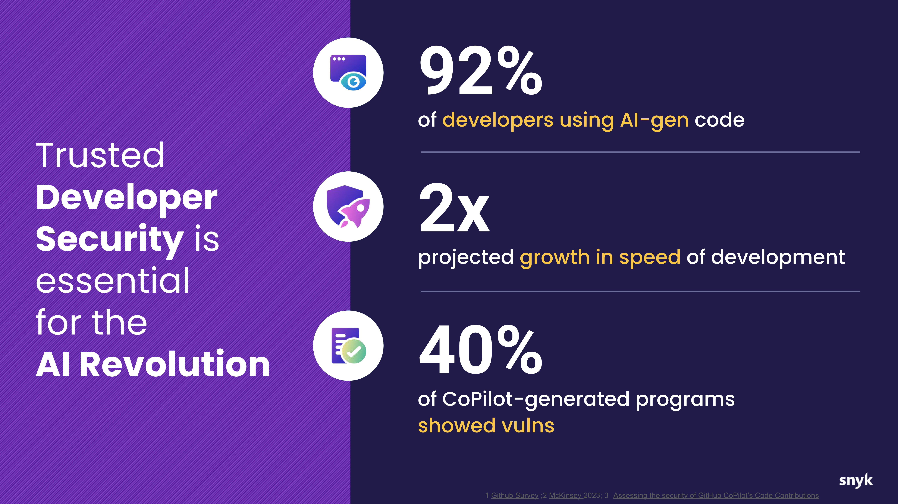

---

<!-- Slide 6 -->
<!-- Speaker notes:
Opening Statement: "As organizations scale their application security efforts, they face growing challenges. The complexity and pace of development make it increasingly difficult to stay ahead of risk. Let’s explore some of the key questions security teams are grappling with today."

Question 1 - Finding Risks Early: "Am I finding risks soon enough? Can I fix them fast enough? The longer a vulnerability remains undiscovered, the higher the cost and potential impact. Teams need tools that can surface risks at the earliest stages of development."

Question 2 - Overwhelming Vulnerabilities: "In a sea of vulnerabilities, can I even see them all? And where do we focus? The sheer volume of issues can be overwhelming, making prioritization essential. Organizations must focus on the vulnerabilities that pose the greatest business risk."

Question 3 - Scaling AppSec: "With compounding development, can AppSec scale? Can I prove it’s working? As development accelerates, security needs to scale alongside it while providing measurable outcomes to justify investments."

Question 4 - Developer Adoption: "Will developers actually use our security tools? Security solutions must be intuitive and integrate seamlessly into developer workflows. Without adoption, even the best tools fail to deliver value."

Conclusion: "These challenges underscore the need for a new approach to application security—one that aligns with the pace of development while providing actionable insights and measurable outcomes."
-->
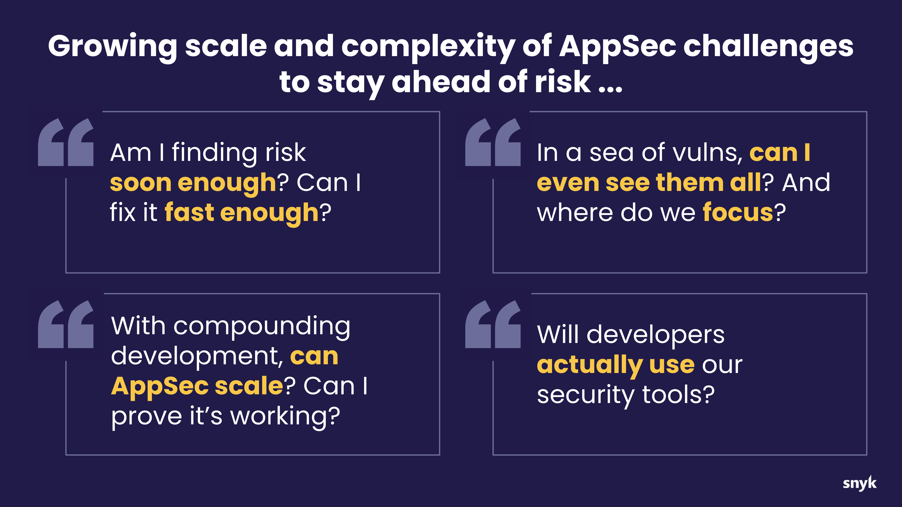

---

<!-- Slide 7 -->
<!-- Speaker notes:
**Opening Statement**:
"Organizations today are adopting various approaches to address application security challenges. However, many of the current solutions fall short in effectively enabling secure and fast development. Let's take a closer look at the two dominant types of solutions and their limitations."

**Legacy Security Tool Vendors**:
- "Legacy tools were designed for a different era. They focus heavily on finding vulnerabilities but fail to provide actionable remediation."
- **Key Challenges**:
  - "They are disconnected from remediation workflows, leaving teams without clear paths to fix vulnerabilities."
  - "Poor developer experience leads to low adoption, making these tools ineffective in practice."
  - "They generate more noise than actionable insights, overwhelming teams with alerts that lack prioritization."

** I know of how a major telecom provider struggled with legacy security tools that failed to integrate into their CI/CD pipelines, leading to delayed fixes and friction with developers.

**Developer Tool Vendors**:
- "On the other hand, developer-focused tools lack the security depth and enterprise-grade capabilities needed for effective application security at scale."
- **Key Challenges**:
  - "Weak security research means they often miss critical vulnerabilities or misprioritize issues."
  - "Limited integrations create silos, preventing teams from having a unified view of their security posture."
  - "A lack of robust reporting and risk management features makes it difficult for organizations to demonstrate the effectiveness of their security efforts."

**Conclusion**:
"Neither legacy security tools nor developer-focused tools can fully address today’s application security needs. This is why organizations must look for solutions that combine deep security expertise with seamless integration into developer workflows—solutions like Snyk."
-->
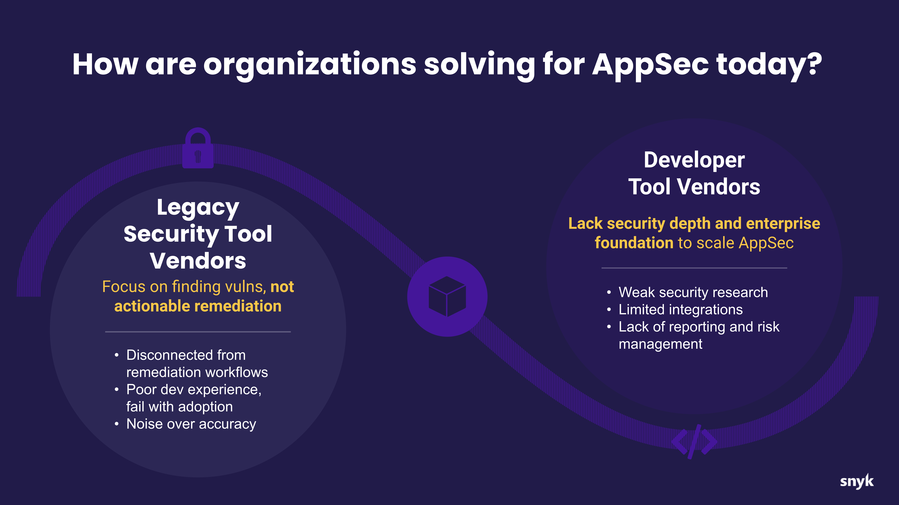

---

<!-- Slide 8 -->
<!-- Speaker notes:
**Key Point**:
"This brings us to the core issue: without the right approach, there is no reliable path to delivering trusted software at the speed required by modern development. The gaps left by existing tools—whether it's the lack of actionable insights, limited integrations, or poor developer adoption—make it nearly impossible to move fast and stay secure."

**Conclusion**:
"This is why a new approach is needed—one that integrates seamlessly into developer workflows, provides actionable remediation, and scales with the pace of modern development. Snyk bridges these gaps, enabling organizations to deliver trusted software quickly and effectively."

Suggested Discovery Questions:
How many appsec tools are you currently using? Which ones?
With your current tooling, how do you bring everything together to
understand your security footprint?
-->
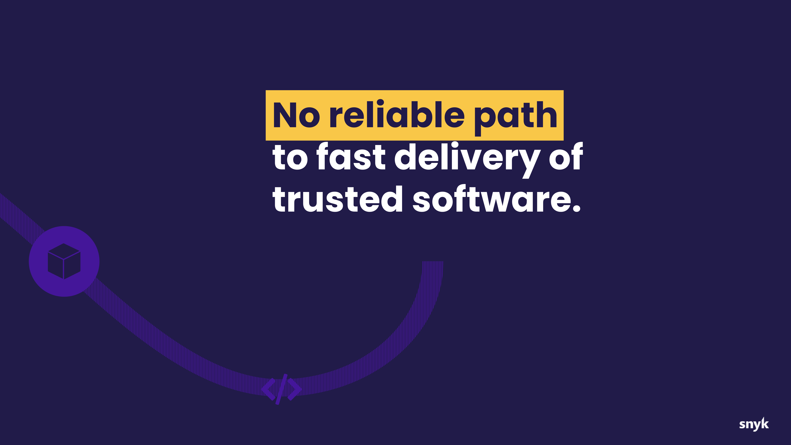

---

<!-- Slide 10 -->
<!-- Speaker notes:
**Shift-left Developer Security**:
"At the core of delivering trusted software is shift-left developer security. This approach ensures that security starts at the developer level—right in the tools and workflows they are already using. By empowering developers to find and fix issues early, we reduce risks before they even reach production."
-->
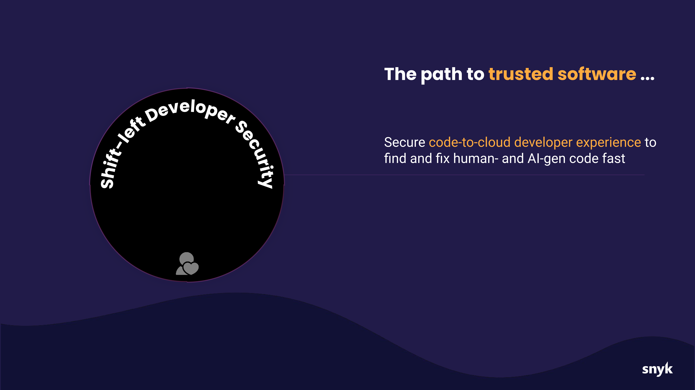

---

<!-- Slide 11 -->
<!-- Speaker notes:
**Comprehensive Governance Capabilities**:
"The next layer focuses on governance, which is critical to scaling security efforts across teams. Comprehensive governance capabilities unite developers and security professionals, creating a unified approach to application security. This ensures that as your development scales, your security processes scale with it."
-->
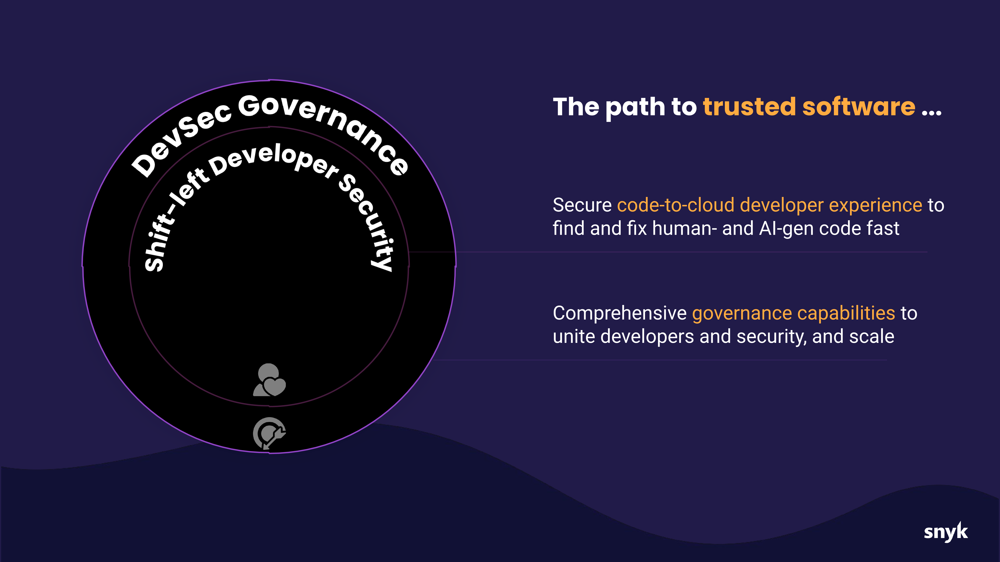

---

<!-- Slide 12 -->
<!-- Speaker notes:
**Holistic Application Risk Management**:
"The final layer expands into application risk management. This is where businesses can gain a clear view of actual risks, prioritize them effectively, and address the issues that matter most to the organization. By focusing on real business risks, teams can ensure their efforts deliver the greatest impact."

**The Path to Trusted Software**:
"When combined, these layers—shift-left developer security, governance, and risk management—form a complete solution for delivering trusted software. This approach enables secure, code-to-cloud development, unites teams under shared governance practices, and provides a clear understanding of application risks."

-->
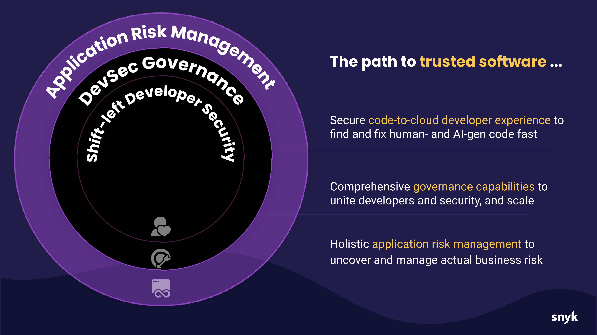

---

<!-- Slide 13 -->
<!-- Speaker notes:
**Evidence-Based Data**:
1. **Shift-Left Maturity**:
   - A **2023 Snyk Customer Value Study** found that organizations using Snyk were able to shift security left effectively, resulting in significant early risk detection and reduced vulnerabilities pre-deployment. 
   - 78% of surveyed customers reported improved development speed and security integration compared to legacy tools.

2. **Developer Process Improvement**:
   - As highlighted by **Gartner Peer Insights**, Snyk simplifies security workflows by embedding tools directly into developer environments like IDEs and CI/CD pipelines.
   - This integration reduces friction between security and development teams, leading to better collaboration and faster fixes.

3. **ROI and Cost Savings**:
   - According to the same study, enterprises realized **$3.5 million in annual ROI** on average due to improved risk management and faster vulnerability resolution.
   - Developer efficiency gains translated into over 100,000 hours saved annually for larger organizations.

4. **Customer Use Case**:
   - Spotify, a global leader in digital streaming, cited seamless adoption of Snyk as a key factor in scaling their security practices across thousands of developers. This resulted in faster deployment cycles without compromising security.

**Key Emphasis (Insights)**:
- Snyk **doesn’t just improve tools**—it transforms workflows by embedding security where developers work. This ensures that security is not a bottleneck but an enabler.
- These results demonstrate how **better collaboration** and **real-time remediation tools** enable enterprises to confidently scale DevSecOps practices without adding significant overhead.
- The ability to **quantify risk reduction** and **track ROI** makes Snyk a strategic choice, not just a technical one, for forward-looking organizations.

**Call to Action**:
"These results highlight the measurable benefits of integrating Snyk into your development workflows. The data shows that investing in developer-first security isn’t just about protecting code—it's about enabling your teams to deliver innovation faster and safer than ever before."
-->
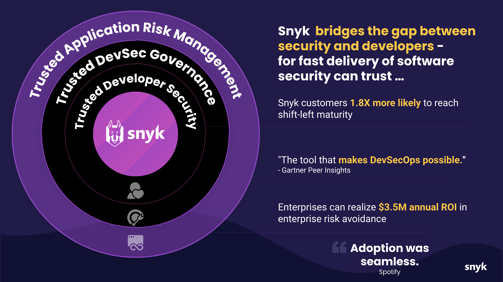

---
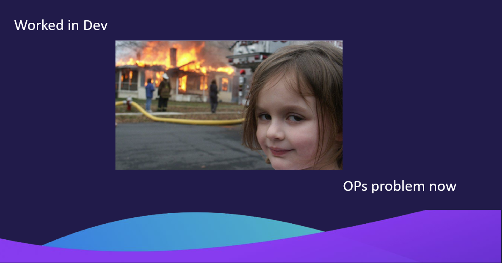

---
<!-- Slide 14 -->
<!-- Speaker notes:
**Opening Statement**:
"Snyk is leading the charge in leveraging AI and ML to revolutionize application security. Let’s break down how we’re redefining the space."

**AppSec’s Only Hybrid Approach**:
- "Snyk’s proprietary AI engine, DeepCode AI, combines machine learning, symbolic AI, and human intelligence to create a hybrid approach. This ensures accuracy, trust, and relevance, addressing one of the biggest criticisms of purely ML-based solutions."

**First AI-Powered Secure Auto-Fix**:
- "Snyk introduced the industry's first secure auto-fix powered by AI. This feature not only identifies vulnerabilities but also provides secure fixes, saving developers valuable time while maintaining high-speed workflows."

**World’s Largest Vulnerability Database**:
- "Our AI is trained on the world’s largest open-source vulnerability database. This allows Snyk to deliver unmatched breadth and depth of security intelligence, helping teams stay ahead of emerging threats."

**Conclusion**:
"By combining cutting-edge AI and ML with a deep understanding of security, Snyk delivers tools that are not just fast, but also trustworthy. This is how we enable developers and security teams to build securely at scale."

Notes : Snyk's Vulnerability Database is recognized as one of the most comprehensive and timely resources for open-source vulnerabilities. It aggregates data from multiple sources, including the National Vulnerability Database (NVD), security advisories, and issue trackers, to provide up-to-date security information. 
SNYK

This extensive database is curated by Snyk's dedicated security team, who enrich the data with actionable context and remediation guidance. By integrating this intelligence into development tools and workflows, Snyk enables developers to identify and fix vulnerabilities efficiently, ensuring a robust security posture throughout the software development lifecycle. 
SNYK DOCS

For more detailed information, you can explore Snyk's Vulnerability Database directly at security.snyk.io.
-->

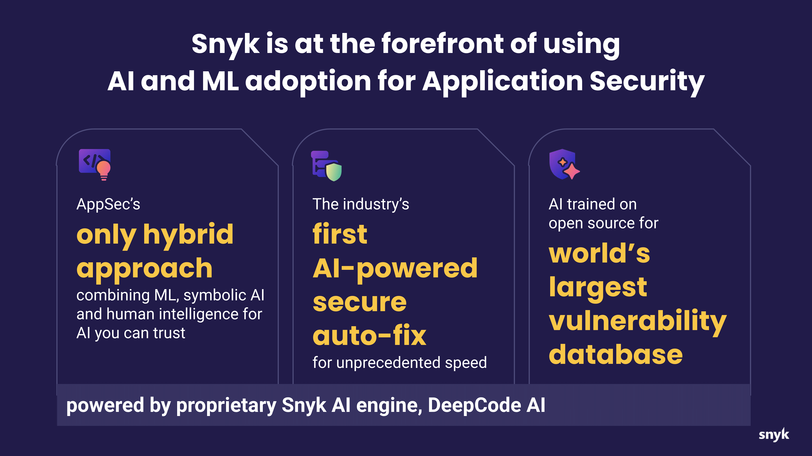

---

<!-- Slide 15 -->
<!-- Speaker notes:
**Opening Statement**:
"Snyk uniquely delivers the capabilities that modern organizations require to stay secure while moving fast. Let’s dive into how we provide extensive visibility, risk-based prioritization, and actionable remediation."

**Extensive Visibility**:
- "Snyk’s vulnerability database is unmatched in size and depth, covering zero-day threats and continuously updated with the latest security intelligence."
- "With a code-to-cloud view, Snyk ensures that your entire software supply chain is secure and compliant, identifying gaps that could otherwise go unnoticed."
- "Enterprise analytics empower organizations to track the performance of their AppSec programs, providing actionable insights to continuously improve."

**Risk-Based Prioritization**:
- "Snyk goes beyond just identifying vulnerabilities by assigning proprietary risk scores to help teams focus on what matters most."
- "Our Application Security Posture Management (ASPM) enables teams to manage and track risks more effectively, ensuring efficient security coverage across applications."
- "Snyk’s research division, one of the best in the industry, ensures you can triage issues based on risk, deployment, and production impact."

**Actionable Remediation and Prevention**:
- "Through its extensive integrations, Snyk ensures security actions are seamlessly integrated into developer workflows, making it easier to act quickly."
- "Our IDE tools and auto-fix pull request capabilities speed up vulnerability fixes while empowering developers to write secure code from the start."
- "With AI-powered auto-fix and developer education programs, Snyk not only helps fix vulnerabilities but also prevents them from occurring in the first place."

-->
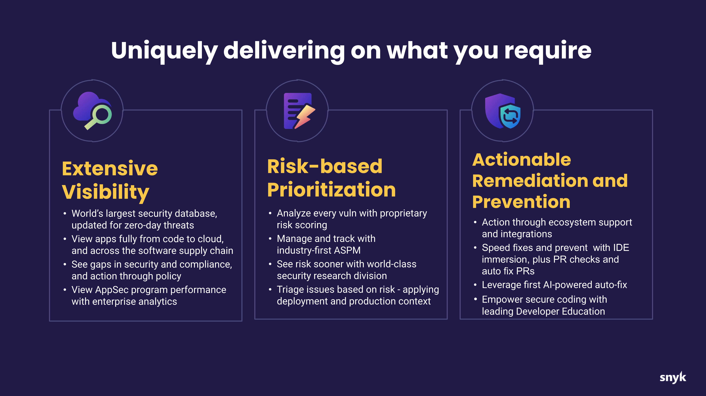

---

<!-- Slide 16 -->
<!-- Speaker notes:
**Emphasis on Developer Experience and Enterprise Foundation**:
- "What sets Snyk apart is its relentless focus on developer experience and enterprise-grade foundations. By integrating seamlessly into developer workflows, Snyk ensures security is intuitive, efficient, and scalable—making it easier for teams to innovate securely."
**Conclusion**:
"By providing unparalleled visibility, prioritization, and actionable remediation, Snyk enables organizations to innovate securely and confidently, ensuring security is not a blocker but a business enabler."

Suggested Discovery Questions:
Could you talk me through how your teams go about triaging a vulnerability found in one of your applications?
How are you understanding which vulnerabilities pose more of a risk to the business than others?
-->
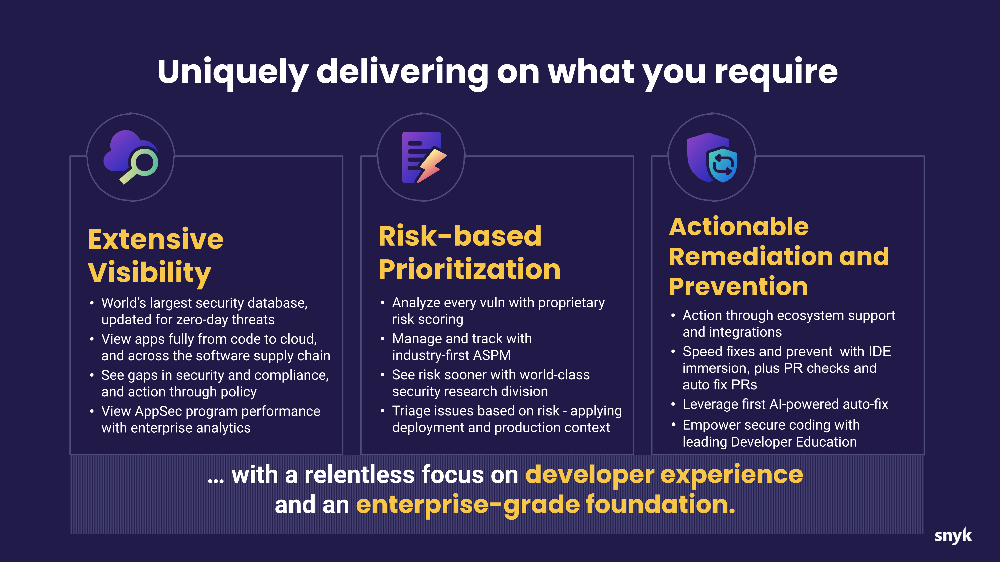

---

<!-- Slide 18 -->
<!-- Speaker notes:
**Opening Statement**:
"Let’s look at real-world examples where Snyk has solved the toughest application security challenges faced by enterprises. These stories showcase how Snyk delivers measurable results across various use cases."

**Shift-Left Developer Security**:
- "An enterprise telecom company with over 3,000 developers faced growing zero-day threats. They needed to adopt shift-left practices to secure their applications earlier in the development lifecycle."
- "By deploying Snyk, they reduced vulnerabilities making it into production by 70%, enabling faster and more secure development."

**Secure AI-Generated Code**:
- "A $50B enterprise technology company was struggling with security concerns during their generative AI rollout."
- "Mandating the use of Snyk helped them secure AI-generated code and scale its use to over 5,000 developers within just 60 days."

**Software Supply Chain Security**:
- "A retail giant with 400,000 employees and 2,700 stores needed to secure their software supply chain without expanding their AppSec team significantly."
- "Using Snyk, they avoided exploitation of OpenSSL vulnerabilities and automated SBOM processes, ensuring compliance and minimizing risk."

**Enterprise-Scale DevSecOps**:
- "A global automotive company with a complex development landscape required visibility and tools to align security with their developers."
- "Snyk provided the automation needed to scan 14,000 projects and onboard over 3,000 developers, unifying their security and development efforts."

**Conclusion**:
"These customer stories demonstrate the versatility and effectiveness of Snyk's solutions, whether it’s shifting left, securing AI code, managing supply chain risks, or scaling DevSecOps practices."
-->
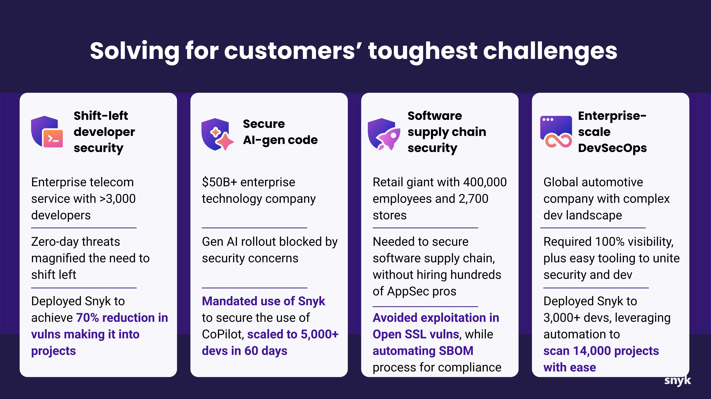

---

<!-- Speaker notes:
**Opening Statement**:
"Snyk doesn’t just improve security—it drives tangible business outcomes by boosting developer productivity and reducing risk. Let’s break down the numbers from a Fortune 500 perspective."

**Developer Productivity ($8.12M ROI)**:
- "Snyk’s automation and efficiency gains deliver significant time savings for developers. Faster implementation and scan times mean vulnerabilities are detected and resolved earlier in the lifecycle."
- "Organizations saved over 100,000 developer hours annually by streamlining processes and improving workflows."
- "This leads to better code quality and more time for developers to focus on innovation rather than reacting to security incidents."

**Risk Reduction ($4.8M ROI)**:
- "Snyk helps organizations proactively reduce risk by finding and fixing more vulnerabilities than traditional tools."
- "Key metrics include a shorter mean time to fix and addressing zero-day vulnerabilities within just 2 days, preventing potential breaches."
- "By quantifying risk avoidance, organizations saved an average of $4.8M, showing the direct financial impact of improved security practices."

**Conclusion**:
"Together, these numbers show how Snyk empowers businesses to balance speed and security, unleashing developer productivity while protecting the bottom line."

**Call to Action**:
"This is how Snyk ensures that the fast delivery of trusted software is not just a goal, but a measurable reality."
-->
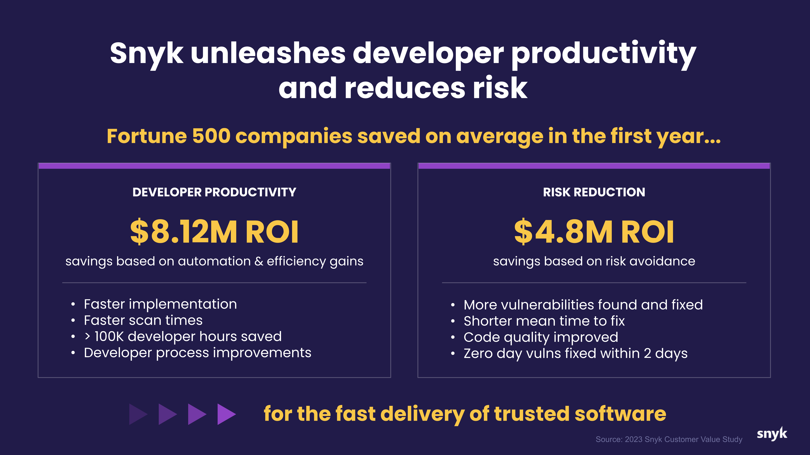

---

<!-- Speaker notes:
**Opening Statement**:
"The Snyk Developer Security Platform is designed to meet the needs of modern development teams, offering unmatched speed, accuracy, and ease of use across the entire software development lifecycle. Let’s walk through its key components."

**Platform Overview**:
- "At its core is the Snyk AppRisk framework, providing a unified risk management layer that spans all product areas. This enables teams to assess and manage risks in a consistent and comprehensive way."

**Key Products**:
1. **Snyk Code**:
   - "Identifies vulnerabilities in proprietary code in real-time as developers write it, integrating directly with IDEs for instant feedback."
2. **Snyk Open Source**:
   - "Secures dependencies by scanning open-source libraries for known vulnerabilities, leveraging Snyk’s industry-leading vulnerability database."
3. **Snyk Container**:
   - "Ensures containerized applications are secure by identifying vulnerabilities in container images, from base images to layers added by developers."
4. **Snyk Infrastructure as Code (IaC)**:
   - "Secures infrastructure configuration files by detecting misconfigurations that could lead to security risks, ensuring compliance before deployment."

**DeepCode AI Engine**:
- "Powering all these products is DeepCode AI, Snyk’s proprietary engine that combines machine learning with symbolic AI and human intelligence to deliver fast, accurate, and actionable results."

**Lifecycle Integration**:
- "The platform seamlessly integrates across the development lifecycle—from IDEs to CI/CD pipelines, collaboration tools, and cloud platforms—ensuring security is embedded everywhere developers work."

**Customer Success and Services**:
- "Snyk’s 24/7/365 customer success and professional services teams ensure smooth adoption, helping organizations maximize the value of their investment."

**Conclusion**:
"The Snyk Developer Security Platform isn’t just about identifying vulnerabilities—it’s about empowering developers to build securely with speed, accuracy, and confidence at every stage of development."
-->
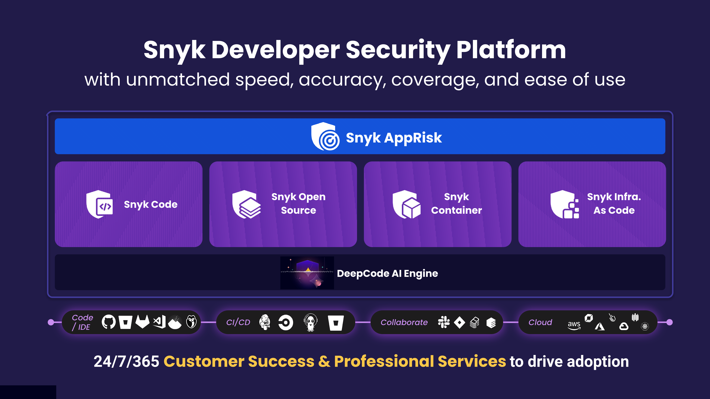

---

<!-- Speaker notes:
**Opening Statement**:
"Snyk has firmly established itself as the leader in developer-first security. Let’s unpack what makes Snyk the trusted choice for developers and enterprises worldwide."

**Developer Loved, Security Trusted**:
- "Snyk accelerates development cycles while simultaneously strengthening security posture. Developers love its ease of use, while security teams appreciate the reliable, actionable results."
- "Recognized by Gartner Peer Insights as a 'Speedy, Efficient, Developer-First Security Tool,' Snyk demonstrates its commitment to empowering both developers and security professionals."

**Serving Customers Across All Industries**:
- "Snyk supports over 3,000 customers across diverse industries, from Fortune 50 enterprises to high-growth startups."
- "One in three of the top Fortune 50 companies rely on Snyk for their security needs, reflecting its scalability and effectiveness."
- "Operating in 76 countries, Snyk’s global footprint ensures that organizations everywhere can benefit from its innovative solutions."

**Established Vendor in Hypergrowth**:
- "Snyk’s leadership is validated by its position as a 'Leader' in the 2023 Gartner Magic Quadrant for Application Security Testing and the 2024 Forrester Wave for Software Composition Analysis."
- "This recognition is backed by strong partnerships with global organizations such as T. Rowe Price, BlackRock, and Salesforce."

**Conclusion**:
"Snyk’s rapid growth and widespread recognition reflect its ability to deliver exceptional value to developers and security teams alike. By bridging the gap between development speed and security rigor, Snyk is shaping the future of application security. "
-->
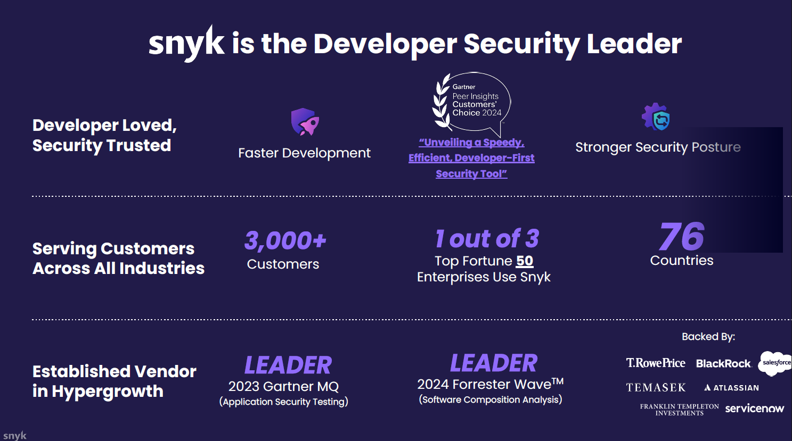

---

<!-- Slide 22 -->
<!-- Speaker notes:
Explain how Snyk empowers developers with actionable remediation while providing enterprises with comprehensive governance.
-->
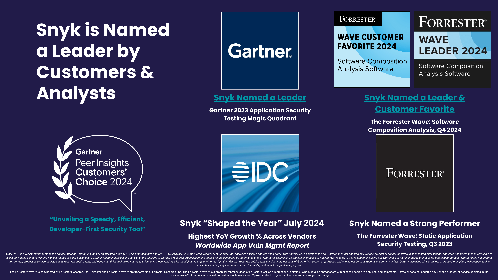

---

<!-- Slide 23 -->
<!-- Speaker notes:
Illustrate Snyk’s role in enabling companies to scale securely while improving development speed.
-->
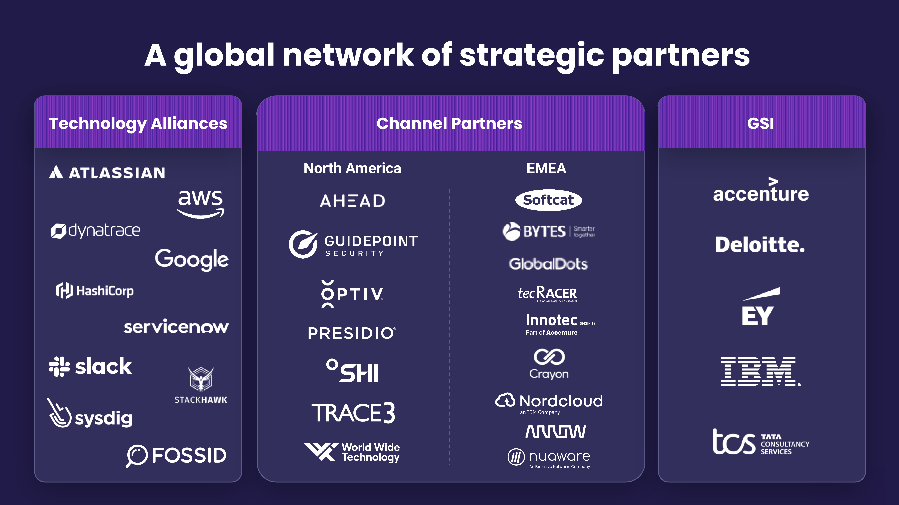

---

<!-- Slide 24 -->
<!-- Speaker notes:
Conclude with a summary of how Snyk bridges the gap between developers and security teams.
-->
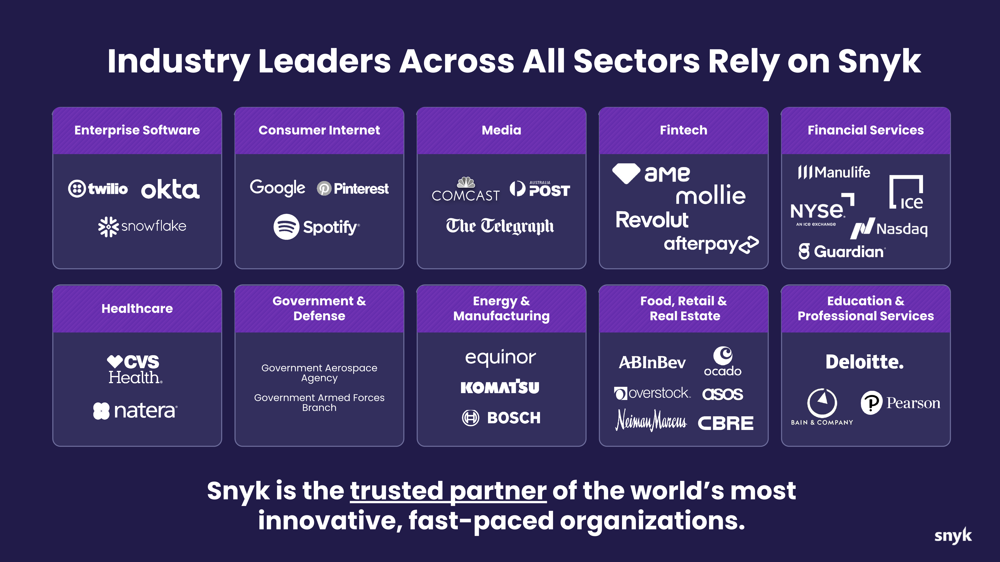

---

<!-- Slide 25 -->
<!-- Speaker notes:
**Opening Statement**:
"As we conclude, let’s focus on what Snyk stands for: trust. Trust in DevOps, trust in the cloud, trust in AI—this is the foundation of secure innovation."

**Key Messages**:
- "The modern digital landscape is built on speed and innovation. But with innovation comes the responsibility of ensuring security without compromising agility."
- "Snyk enables limitless innovation by providing tools that developers love and security professionals trust. Whether you’re building in the cloud, leveraging AI, or streamlining DevOps, Snyk ensures you can do it with confidence."

**Closing Statement**:
- Trust is the foundation of innovation. With Snyk, you can innovate fearlessly, secure in the knowledge that your software is protected from development to deployment. Let’s build a secure future together.
-->
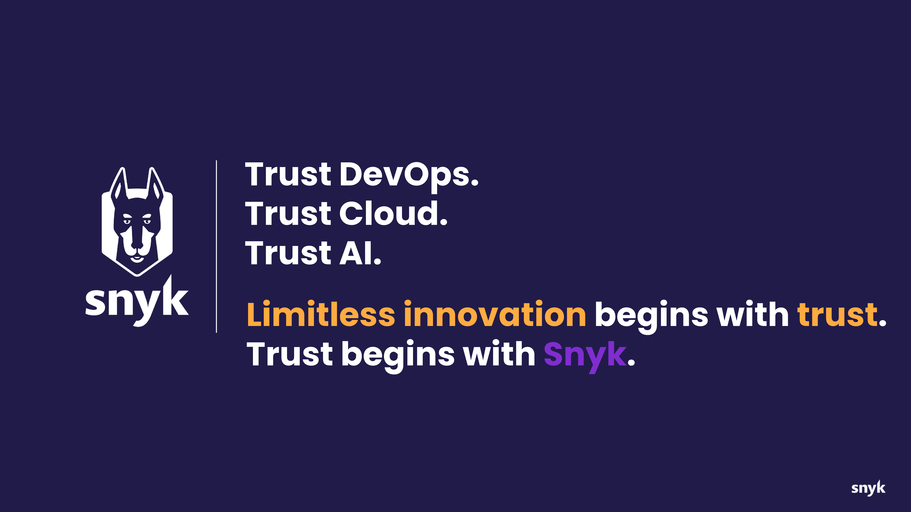

---

<!-- Slide 26 -->
<!-- Speaker notes:
Leave the audience with a final impactful message: Secure innovation starts with Snyk.
-->
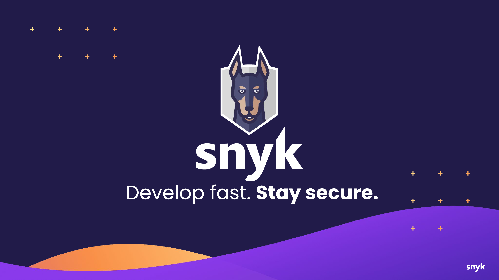
